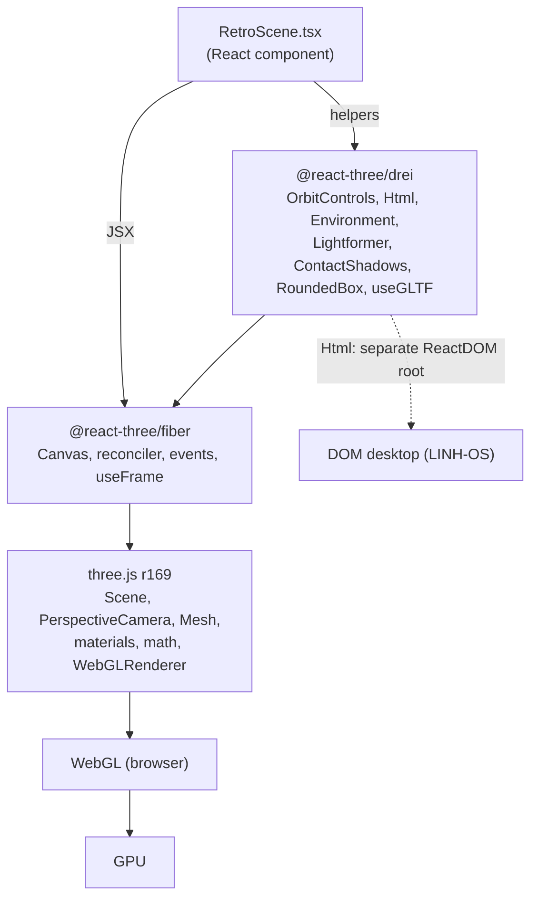
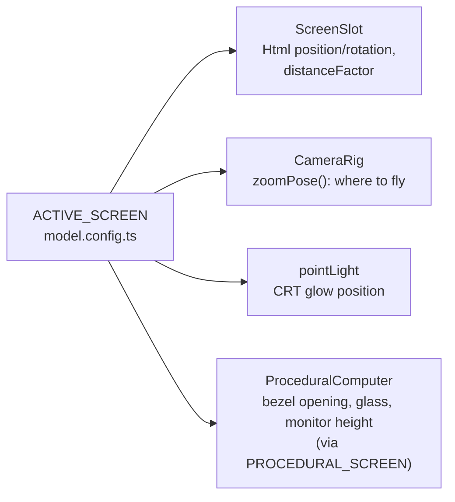
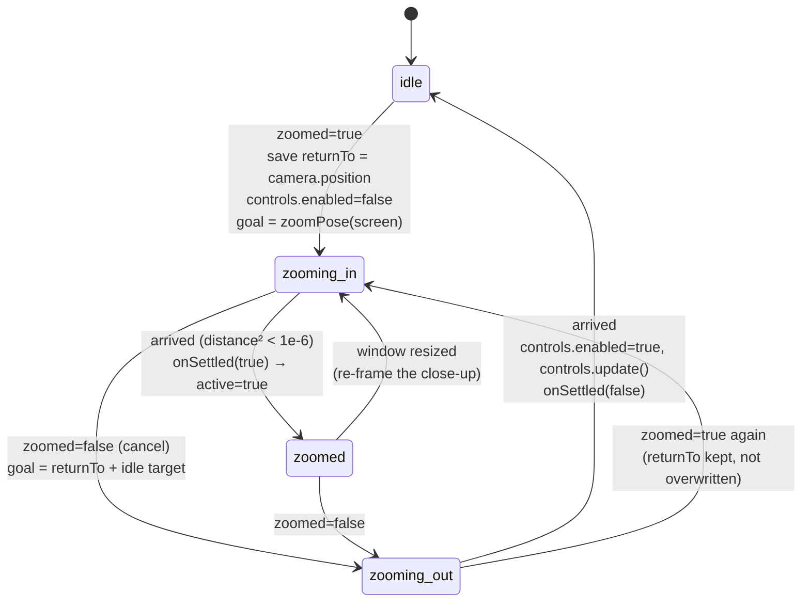
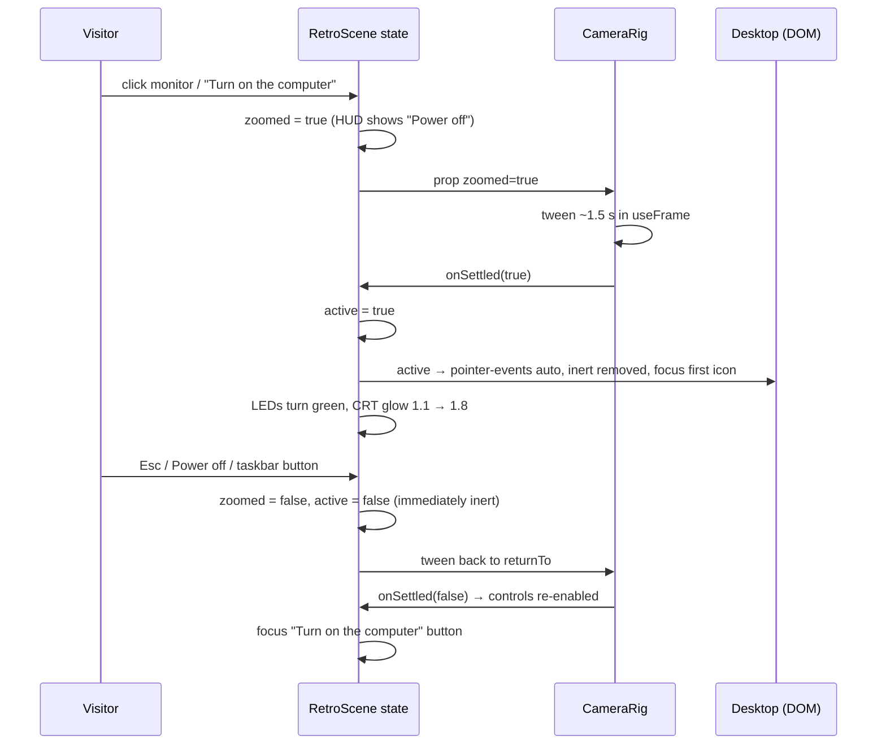
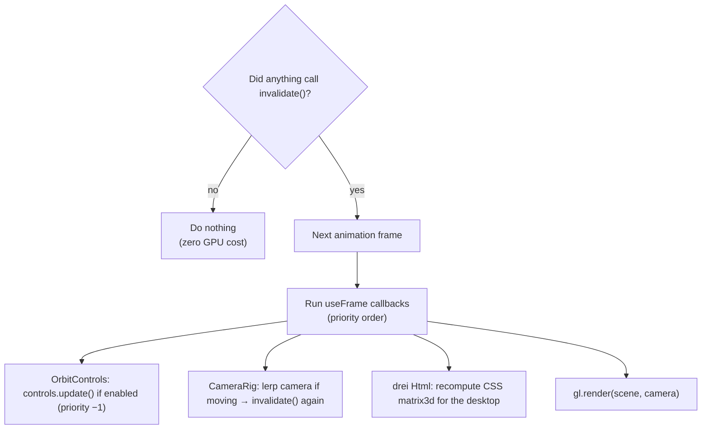

# 3D architecture

How the 3D scene at `/` is assembled, how it changes over time, and how it connects to React and
the DOM desktop. For the underlying concepts, see [3D_GUIDE.md](3D_GUIDE.md).

## The stack, as used here



- **three.js** owns the real objects, the maths and the renderer.
- **R3F** turns JSX into three.js objects, keeps them in sync with props, runs the render loop, and
  turns DOM pointer events into 3D hit-tests.
- **drei** supplies camera controls, the DOM-on-a-surface trick, lighting helpers and model loading.
- The versions are R3F v8 and drei v9, the line that supports React 18. R3F v9 targets React 19, which is the likely reason for staying on v8 (INFERRED).

## Component tree inside `<Canvas>`

```text
RetroScene
└─ <Canvas eventSource={.retro-scene div} eventPrefix="client" frameloop="demand" dpr={[1,1.75]}
           camera={{fov:35, near:0.1, far:90}} gl={{antialias, alpha:true, powerPreference:"high-performance"}}>
   ├─ ambientLight · directionalLight ×3 · pointLight (CRT glow)
   ├─ Environment (Lightformer ×3, rendered once into a 64px cube map → scene.environment)
   ├─ NightCity                          wall, window frame, sky, 3 skyline layers, Boston landmarks
   ├─ <group onClick onPointerOver onPointerOut>   ← the only interactive object
   │   ├─ Suspense
   │   │   └─ ProceduralComputer (default) | GlbComputer (if COMPUTER_MODEL.kind === "glb")
   │   └─ ScreenSlot → drei <Html transform occlude="blending"> → <Desktop mode="3d"/> (DOM)
   ├─ ContactShadows (rendered once)
   ├─ OrbitControls (makeDefault; drives the default camera)
   └─ CameraRig (renders nothing; animates camera in useFrame)
```

## Scene graph

What three.js actually holds (simplified; lights and helpers omitted). Positions are world units.

```text
Scene
├─ NightCity <group>
│  ├─ sky plane              150×64 at (0, 8, −46)          MeshBasic + canvas gradient
│  ├─ skyline layer ×3       at z −36 / −23 / −12.5          MeshBasic + softened canvas, transparent
│  ├─ BostonLandmarks <group>  painted, softened cutout planes (MeshBasic, transparent), one per tower
│  │  ├─ prudential          z = −11, x −0.91…0.23       slab + side sliver, penthouse, mast, red beacon
│  │  ├─ 111-huntington      z = −10, x −0.12…0.82       shaded "cylinder", finned crown, dome, ring
│  │  └─ hancock             z = −11.5, x −9.55…−8.25    dark-glass slab with sheen
│  ├─ wall boxes ×4          around the window opening, z = −1.95 (oversized: ±40 wide)
│  └─ window frame, mullions ×2, sill
├─ interactive <group>
│  ├─ ProceduralComputer <group>
│  │  ├─ desk                7.5 × 0.12 × 3.9, top surface at y = 0
│  │  ├─ base unit <group>   z = −0.25 (RoundedBox + front-panel <group> at z = 0.852: drive slots, vents, LEDs)
│  │  ├─ swivel stand ×2
│  │  ├─ monitor <group>     y = 1.36 (screen centre height)
│  │  │  ├─ bezel            ExtrudeGeometry with 4:3 hole, z ≈ 0.37
│  │  │  ├─ recess           dark box, 0.02 behind the screen plane
│  │  │  ├─ glass            dark plane, 0.006 behind the screen plane (only visible if the HTML is missing)
│  │  │  ├─ front housing, tapered tube, back plate, vent grooves ×4
│  │  │  └─ chin <group>     badge, knobs ×2, power LED, button
│  │  ├─ Keyboard <group>    (−0.05, 0, 1.5) tilted 0.05 rad: body + InstancedMesh (91 keys)
│  │  ├─ cords ×2            TubeGeometry along CatmullRom curves
│  │  ├─ mousepad, Mouse <group> (egg body, skirt, seams, wheel)
│  │  ├─ sticky notes <group> sage pad under a light-yellow pad
│  │  ├─ PottedPlant <group> (−1.75, 0, 0.35): saucer, pot, rim, soil, 13 leaves (one shared leafGeometry; yaw group → tilted mesh)
│  │  └─ GeoBird <group>     (0.94, 0.42, 0.24) on the base unit, right of the monitor, scale 0.17: 3 ConvexGeometry hulls (body, head+beak, tail), flat-shaded light wood
│  └─ Html <group>           at ACTIVE_SCREEN.position (0, 1.36, 0.36)
│     └─ occlusion plane     1.28 × 0.96, invisible, cuts the hole and receives clicks
└─ ContactShadows <group>    (0, 0.002, 0.4)
```

The camera is not a child of the scene; R3F manages it as `state.camera`.

## Configuration: the screen ties everything together

[model.config.ts](../src/retro/scene/model.config.ts) exports `ACTIVE_SCREEN: ScreenRect`
(`position`, `rotation`, `width`, `height` of the glass, in world units). Four things read it:



Change the screen rect and the desktop, the zoom and the glow all follow. With the procedural
computer, the model geometry also follows (it's built *from* `PROCEDURAL_SCREEN`).

`SCREEN_PIXELS = 800×600` is the desktop's fixed CSS resolution; `.retro-desktop--3d` in
`retro.css` hard-codes the same size. It was 960×720; it dropped to the classic Win98 resolution so
text isn't scaled too small on small laptops (zoomed in, the glass fills 86% of the viewport height,
so a 650px-tall viewport shows the screen at ~0.93×). Fewer CSS pixels on the same glass means
everything renders bigger.

### Fonts on the screen
Window content (title bars, text, buttons inside windows) uses `--r-win` (Tahoma → Verdana → DejaVu Sans,
system fonts, nothing downloaded): 13px body, bold titles. Terminal-style text uses `--r-term` (VT323).
The desktop "home screen" (icon labels, taskbar and clock, wallpaper, idle overlay) keeps the pixel
fonts VT323/Silkscreen, as does everything outside the computer (HUD, boot screen). A pixel recreation of Win98's
MS Sans Serif was tried first and dropped: at its native 11px it was hard to read once scaled in 3D.

### Cursors
The whole retro page (`/`, boot loader included) uses a pixel-art arrow (`--r-cursor-arrow`, 20×32), and
links, buttons and the hoverable computer get a pixel pointing hand (`--r-cursor-pointer`, 30×34).
`RouteChrome` in `App.tsx` adds `html.retro-cursor` while on `/`, and `retro.css` styles under that class;
classic routes keep their own dot-and-ring `CursorEffect`. Both cursors are inline SVG data URIs on `:root`
in `retro.css`, drawn at 2 CSS px per pixel, with the ASCII grid kept in a comment beside each. Cursor
images are drawn in screen pixels, so their size doesn't change with the 3D scale. Window title bars keep
the system `grab` cursor and the terminal keeps the text cursor.

### Scrolling inside the screen
Chromium won't wheel-scroll anything inside a `transform-style: preserve-3d` context, which drei's
`<Html transform>` creates. In 3D, `Desktop` therefore listens for `wheel` itself, finds the nearest
scrollable ancestor of the target and moves its `scrollTop` (see [3D_GUIDE §17](3D_GUIDE.md#17-scrolling-inside-css-3d-transforms)).

## The screen: DOM on glass

[ScreenSlot.tsx](../src/retro/scene/ScreenSlot.tsx):

```tsx
<Html transform occlude="blending" position={screen.position} rotation={screen.rotation}
      distanceFactor={(screen.width * 400) / SCREEN_PIXELS.width}
      pointerEvents={active ? "auto" : "none"} zIndexRange={[100, 0]}>
  <Desktop mode="3d" active={active} … />
</Html>
```

| Prop | Effect |
|---|---|
| `transform` | DOM gets a full CSS `matrix3d` each frame, so it sits *in* 3D (tilts and foreshortens with the camera), not just pinned at a point. |
| `occlude="blending"` | canvas goes in front with a transparent hole (see [3D_GUIDE §12](3D_GUIDE.md#12-depth-z-fighting-and-the-hole-in-the-canvas)). |
| `distanceFactor` | sets CSS px per world unit so 960 px = 1.28 units. |
| `pointerEvents` | the DOM only receives clicks once the camera has arrived (`active`). |
| `zIndexRange={[100, 0]}` | keeps drei's computed z-indexes small; with blending the canvas becomes z-index 50 and the HTML stays below it. |

drei renders the `<Desktop>` into **its own `ReactDOM.createRoot`**, appended to the R3F event
source element (the `.retro-scene` div). Consequences:
- no router or app context inside the desktop → `navigate` etc. are passed in explicitly;
- the desktop's own state (open windows, terminal history) lives in that root, and survives zooming
  in/out because `ScreenSlot` stays mounted.

## Camera system

Two actors move the camera, never at the same time:

| Actor | When | How |
|---|---|---|
| **OrbitControls** (drei → three-stdlib) | idle | drag on the scene rotates around `target` within azimuth/polar limits, with damping; calls `invalidate()` on change |
| **CameraRig** ([CameraRig.tsx](../src/retro/scene/CameraRig.tsx)) | zooming in, zoomed, zooming out | sets `controls.enabled = false`, lerps `camera.position` and `controls.target` toward a goal in `useFrame` |

### CameraRig state machine



Details that matter:
- `phase`, `goal`, `returnTo` are **refs**, not state. Changing them doesn't re-render anything.
- The zoom-out returns to **wherever you had orbited to** (`returnTo`), not to the initial view.
- **Disabling the controls is essential.** drei's `OrbitControls` calls `controls.update()` every
  frame *only while enabled*, and `update()` clamps the camera to `maxPolarAngle` (1.42 rad). The head-on
  close-up is at polar ≈ π/2 (1.57), so if the controls stayed enabled they would push the camera
  back up every frame (CONFIRMED by reading drei's `OrbitControls.js`).
- `onSettled` is stored in a ref (`onSettledRef`) so the effect doesn't re-run when the callback identity changes.

## Two-step "power on": `zoomed` vs `active`



`zoomed` is *intent*, `active` is *arrived*. Keeping them separate stops clicks from landing on a
desktop that's still flying toward you (CONFIRMED: comment in `RetroScene.tsx`).

## Frame loop and reactivity

### What runs when

R3F's render loop, with `frameloop="demand"`:



**Who calls `invalidate()`:**

| Source | Why |
|---|---|
| OrbitControls `change` event | user drags; damping keeps emitting changes until the motion settles |
| CameraRig `useFrame` | keeps requesting frames until the camera arrives |
| CameraRig `useEffect` | kicks off a transition |
| R3F reconciler | any prop change on a scene object (e.g. LED colour, light intensity when `active` flips) |
| window resize | R3F resizes the canvas and re-renders; while zoomed, CameraRig's effect also re-runs (it depends on `size`) and invalidates |

**Not involved:** the desktop's DOM updates (window drags, terminal output, the taskbar clock, the
CSS CRT flicker) happen in the DOM and need **no** WebGL frames. The canvas only needs a new frame
when the *camera or 3D objects* change, because that's when the hole and the CSS matrix must move.

### React state vs per-frame vs imperative

| Layer | Lives in | Changes | Examples in this code |
|---|---|---|---|
| React state | `useState` / `useReducer` | rarely, in response to events | `zoomed`, `active` (RetroScene); windows (desktop reducer); `mode` (useRetroMode) |
| Per-frame mutation | refs + `useFrame` | continuously while animating | camera position/target (CameraRig) |
| Imperative one-off | refs + direct mutation | setup or very frequent DOM events | keycap matrices (`useLayoutEffect`), `is-hovering` class on hover, window `style.left/top` during drag, `inert` attribute |

**When to use which** (the pattern this codebase follows):
- Does it change **every frame**? → `useFrame` + refs. Never `setState` per frame.
- Does it change **because the user did something discrete** (clicked, toggled)? → React state, let R3F apply props.
- Does a **high-frequency event** (pointer move, hover) only need a visual tweak? → mutate the DOM or object directly and commit to state at the end (see `Window.tsx` drag, `setHovering`).
- Did you change something three.js can't see as a prop (e.g. instance matrices, geometry attributes)? → set `needsUpdate = true` and, under demand rendering, call `invalidate()`.

## Resource lifecycle

| Resource | Created | Freed |
|---|---|---|
| JSX geometries/materials (`<boxGeometry>`, `<meshStandardMaterial>`) | by R3F on mount | by R3F on unmount |
| Shared materials/geometries in `ProceduralComputer` | `useDisposable(factory)` (= `useMemo` once) | `useDisposable` cleanup calls `.dispose()` on each |
| NightCity canvas textures + materials | `useMemo` | `useEffect` cleanup: `map.dispose()`, `material.dispose()` |
| GLB scene (if used) | `useGLTF` (cached) | cleanup traverses meshes, disposes geometry, materials, textures; `useGLTF.clear(url)` |
| WebGL context | `<Canvas>` mount | `<Canvas>` unmount (leaving `/`, switching to 2D) |
| Probe WebGL context (`hasWebGL`) | once per page load | immediately, via `WEBGL_lose_context` |

Leaving `/` unmounts the whole canvas, so the next visit rebuilds everything (and the lazy JS chunk
is already cached by the browser).

## The 2D fallback is a first-class path

`/` without 3D renders the *same* `<Desktop>` in `mode="2d"`, full-window, with a `compact`
(phone) layout under 640 px. When WebGL exists and the viewport is big enough, three things go back
to 3D: the taskbar's "3D view" button, a pixel × in the top-right corner, and Esc with no windows open. The 3D JavaScript is in a separate lazy chunk (`RetroScene-*.js`, ~930 KB minified before
gzip in the current `dist/`), which 2D visitors never download.

## Extension points

| Want to… | Extend here |
|---|---|
| swap the computer for a downloaded model | `model.config.ts` (`COMPUTER_MODEL`, `screen`, `hideMeshes`) |
| add a desk prop | a new component inside the interactive `<group>` (clickable) or outside it (not clickable) |
| add a new interactive object with its own behaviour | a sibling `<group>` with its own handlers; see [CHANGE_GUIDE.md](CHANGE_GUIDE.md#add-a-new-interaction) |
| change the backdrop | `NightCity.tsx` (`WINDOW`, `LAYERS`, landmarks), keep `ROOM_COLOR` in sync with `.retro-page` background |
| add an app to the screen | `apps.tsx` registry + `useDesktop.ts` `APP_IDS` |
