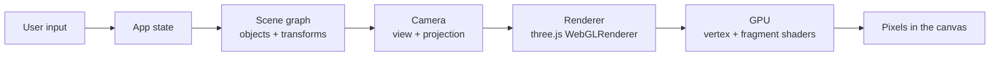
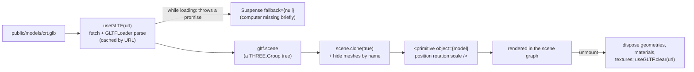

# 3D development guide (concepts → this codebase)

This guide teaches the 3D ideas this project actually uses, from first principles, and points at the
exact code where each one appears. It assumes you're comfortable with React and TypeScript but new
to 3D.

**Stack in one sentence:** [three.js](https://threejs.org) is the 3D engine (scene objects, math,
WebGL renderer). [React Three Fiber (R3F)](https://docs.pmnd.rs/react-three-fiber) lets you write
three.js objects as JSX (`<mesh>`, `<group>`). [drei](https://github.com/pmndrs/drei) is a library
of ready-made R3F helpers (`OrbitControls`, `Html`, `Environment`, `RoundedBox`…).

Every lowercase JSX tag inside `<Canvas>` is a three.js class: `<mesh>` → `new THREE.Mesh()`,
`<boxGeometry args={[1,2,3]}>` → `new THREE.BoxGeometry(1,2,3)`, `<meshStandardMaterial color="red">`
→ `new THREE.MeshStandardMaterial()` with `.color` set. Props become properties; `args` become
constructor arguments. Once that clicks, most of the scene code reads like a description of objects.

Contents:
1. [Coordinate systems](#1-coordinate-systems)
2. [Units and scale](#2-units-and-scale)
3. [Vectors](#3-vectors)
4. [Transformations: position, rotation, scale](#4-transformations-position-rotation-scale)
5. [Parent/child transforms and the scene graph](#5-parentchild-transforms-and-the-scene-graph)
6. [Matrices](#6-matrices)
7. [The camera](#7-the-camera)
8. [The rendering pipeline](#8-the-rendering-pipeline)
9. [Meshes and geometry](#9-meshes-and-geometry)
10. [Materials and textures](#10-materials-and-textures)
11. [Lighting](#11-lighting)
12. [Depth, z-fighting and the "hole" in the canvas](#12-depth-z-fighting-and-the-hole-in-the-canvas)
13. [Assets and 3D models](#13-assets-and-3d-models)
14. [Smooth motion: lerp and frame-rate independence](#14-smooth-motion-lerp-and-frame-rate-independence)
15. [The frame loop (React vs per-frame code)](#15-the-frame-loop-react-vs-per-frame-code)
16. [WebGL context loss](#16-webgl-context-loss)
17. [Scrolling inside CSS 3D transforms](#17-scrolling-inside-css-3d-transforms)

Related docs: [3D_ARCHITECTURE.md](3D_ARCHITECTURE.md) (how the scene is assembled),
[INTERACTION_GUIDE.md](INTERACTION_GUIDE.md) (raycasting, clicks, mental models),
[DEBUGGING.md](DEBUGGING.md) (common mistakes).

---

## 1. Coordinate systems

### What it means
A coordinate system is the agreement about what `(x, y, z)` means: where `(0,0,0)` is, and which
way each axis points. In 3D you constantly move between several of them.

### Why it matters
Most "it's in the wrong place" bugs are really "I used a number from one coordinate system in
another one". A mouse position in pixels, a mesh position relative to its parent, and a camera
position in the world are all `x, y` (or `x, y, z`), but they mean completely different things.

### How it works
three.js uses a **right-handed, Y-up** system:

```text
        +Y (up)
         │
         │
         └──── +X (right)
        ╱
      +Z (toward the viewer, out of the screen)
```

The spaces you'll meet, in the order a vertex travels through them when drawn:

| Space | Meaning | Example in this project |
|---|---|---|
| **Local / object space** | Coordinates relative to an object's own origin (its parent `<group>`). | The chin LED at `[0.5, 0, 0.004]` is relative to the chin group, not the world. |
| **World space** | One shared space for the whole scene. | The screen centre is at world `[0, 1.36, 0.36]`. |
| **Camera / view space** | The world re-expressed from the camera's point of view: camera at origin looking down its own −Z. | Computed by three.js every frame; you rarely touch it. drei's `Html` uses `camera.matrixWorldInverse` to build a CSS transform from it. |
| **Clip space / NDC** | After projection: visible things fall in a −1…+1 cube ("normalised device coordinates"). | R3F converts the mouse into NDC: `x = clientX/width*2−1`, `y = −(clientY/height)*2+1`. |
| **Screen space** | Pixels, origin at the top-left, **Y pointing down**. | `clientX/clientY` in pointer events; window drag offsets in `Window.tsx`. |

Note the Y flip between screen space (down) and NDC/world (up). That's why the formula above has a minus sign.

### Where it appears in this project
The scene is laid out in world space like this (CONFIRMED from the numbers in the scene files):

```text
SIDE VIEW (looking from the right, +X toward you)          TOP VIEW (looking down, −Y)

 y                                                          back (−Z)
 ↑   window 1.05…4.3                                        z=−46   sky plane
 │   ┌──┐                                                   z=−36…−12.5  skyline layers
 │   │  │      CRT screen centre (0, 1.36, 0.36)            z≈−10…−11.5  Boston landmarks
 │   │  │      ┌───┐                                        z=−1.95 back wall + window
 │   │  │      │   │▏← glass faces +Z                    ┌──────────── desk ─────────────┐
 │  wall       │   │                                     │ vase       base unit/monitor   │
 0 ──┴──┴──────┴───┴─────── desk top (y = 0) ──── → z    │ floppies    keyboard     mouse │
    −1.95     −0.25  0.36          1.5 keyboard          └────────────────────────────────┘
                                                            front (+Z) — camera is out here
```

- The **desk top is the y=0 plane** ("desk top at y=0" comment in `ProceduralComputer.tsx`).
- **+Z points from the wall toward the visitor**; the monitor faces +Z; the keyboard is in front (z≈1.5).
- **X is left/right**: vase on the left (−1.75), mouse on the right (+1.62).
- The night city is far down −Z (up to −46), *behind* the wall, visible through the window.

Conversions happen in exactly three places:
1. **three.js internally**, every frame: local → world → camera → clip → screen (you don't write this).
2. **R3F pointer events**: screen → NDC → a 3D ray in world space (see [INTERACTION_GUIDE.md](INTERACTION_GUIDE.md)).
3. **drei `<Html transform>`**: world → CSS `matrix3d(...)` so the DOM desktop sits on the glass.

### Example from this project
```tsx
// ProceduralComputer.tsx: the monitor group lifts everything inside it to screen height.
<group position={[0, PROCEDURAL_SCREEN.position[1], 0]}>            {/* world y = 1.36 */}
  <group position={[0, -0.6, monitorZ + 0.1]}>                       {/* chin: local to monitor */}
    <mesh position={[0.5, 0, 0.004]}> … LED … </mesh>                 {/* local to chin */}
```
The LED's world position is the sum of the chain: `(0,1.36,0) + (0,−0.6,0.46) + (0.5,0,0.004)` =
`(0.5, 0.76, 0.464)` (no rotations/scales in this chain, so it's plain addition).

### Mental model
**Every number has an address.** Before using a coordinate, ask "relative to what?": its parent group,
the world, the camera, or the top-left of the browser window.

### Related concepts
Transforms (§4), parent/child (§5), matrices (§6), raycasting ([INTERACTION_GUIDE.md](INTERACTION_GUIDE.md)).

---

## 2. Units and scale

### What it means
three.js has no built-in unit. `1` means whatever you decide.

### Why it matters
Lights with a `distance`, camera `near`/`far` planes, shadow blur, and orbit limits all depend on
the scene's scale. If one object is built in centimetres and another in metres, they won't fit.

### How it works / where it appears
This project never states a real-world unit (UNKNOWN; see [UNKNOWN.md](UNKNOWN.md)). What's
consistent is the relative scale: the desk is `7.5 × 3.9` units, the screen `1.28 × 0.96` (4:3), a
keycap `0.1` (`KEY_U`). The camera's `near = 0.1`, `far = 90` are chosen to contain everything
from the keyboard to the sky plane at z = −46.

The one place units are converted to pixels is `ScreenSlot.tsx`: drei's `Html` maps
**1 world unit → `400 / distanceFactor` CSS pixels**, so

```ts
const distanceFactor = (screen.width * 400) / SCREEN_PIXELS.width; // 1.28*400/800 = 0.64
// → 1 unit = 625 CSS px → the 800 px-wide desktop is exactly 1.28 units wide = the glass.
```

### Mental model
Pick a scale and stick to it. Here, **the screen glass (1.28 units ↔ 800 px) is the ruler**.

### Related concepts
Camera near/far (§7), `distanceFactor` ([3D_ARCHITECTURE.md](3D_ARCHITECTURE.md#the-screen-dom-on-glass)).

---

## 3. Vectors

### What it means
A `Vector3` is three numbers `(x, y, z)`. The same type represents two different ideas:
- a **position** (a point: "where"), e.g. the orbit target `(0, 0.95, 0.35)`;
- a **direction / offset** (an arrow: "which way and how far"), e.g. "from the screen, straight out".

### Why it matters
Camera placement, zoom targets, the vase stems, all of it is vector arithmetic. Knowing a few
operations lets you place anything relative to anything else.

### How it works

| Operation | Meaning | three.js |
|---|---|---|
| Add | move a point by an offset | `a.add(b)`, `a.addScaledVector(dir, d)` (= `a + dir*d`) |
| Subtract | arrow from B to A | `a.clone().sub(b)` |
| Length (magnitude) | how long the arrow is | `v.length()` |
| Distance | length of `a − b` | `a.distanceTo(b)`, `a.distanceToSquared(b)` (no square root, cheaper) |
| Normalize | keep the direction, set length to 1 | `v.normalize()` |
| Lerp | point part-way from a to b | `a.lerp(b, t)` |
| Dot product | how aligned two directions are (1 same, 0 perpendicular, −1 opposite) | `a.dot(b)` |
| Cross product | a direction perpendicular to two others | `a.clone().cross(b)` |

**Mutation warning:** most three.js vector methods **modify the vector in place** and return it.
`IDLE_TARGET.addScaledVector(...)` would permanently move the shared constant; that's why the code
does `IDLE_TARGET.clone().addScaledVector(...)`.

### Where it appears in this project

**Camera placement as "point + direction × distance"** ([RetroScene.tsx](../src/retro/scene/RetroScene.tsx)):
```ts
const IDLE_DIRECTION = new Vector3(0.38, 0.42, 1).normalize(); // a unit arrow: right, up, toward viewer
return IDLE_TARGET.clone().addScaledVector(IDLE_DIRECTION, distance);
```
`normalize()` matters: it makes `distance` mean real distance. Without it, the arrow's length
(≈1.15) would silently stretch every distance by 15%.

**Zoom target: "point on the screen + screen-normal × distance"** ([CameraRig.tsx](../src/retro/scene/CameraRig.tsx)):
```ts
const normal = new Vector3(0, 0, 1).applyEuler(new Euler(...screen.rotation)); // which way the glass faces
const target = new Vector3(...screen.position);
position = target.clone().addScaledVector(normal, Math.max(byHeight, byWidth));
```
A *normal* is a unit direction perpendicular to a surface. `(0,0,1)` is "out of the glass" before
rotation; `applyEuler` turns it with the screen, so a tilted screen in a `.glb` still gets a
head-on camera.

**Stems of the flowers: subtract, length, midpoint, normalize** ([ProceduralComputer.tsx](../src/retro/scene/ProceduralComputer.tsx) `Vase`):
```ts
const dir = end.clone().sub(base);              // arrow from stem base to bloom
length: dir.length(),                           // stem length
mid: base.clone().add(end).multiplyScalar(0.5), // cylinder is centred, so place it at the midpoint
quat: new Quaternion().setFromUnitVectors(up, dir.normalize()), // rotate +Y to point along the stem
```
That's a pattern worth memorising: **to draw a line segment with a cylinder, place it at the midpoint,
scale it to the length, and rotate its axis onto the direction.**

**"Have we arrived?"** uses squared distance (CameraRig): `camera.position.distanceToSquared(position) < 1e-6`
means "closer than 0.001 units", without computing a square root every frame.

**Dot and cross products** are *not* called directly in this project's code (CONFIRMED by search), but they run inside
the library calls it uses: `setFromUnitVectors` uses both, `camera.lookAt` uses cross products to
build the camera's orientation, and every lit material computes `dot(surfaceNormal, lightDirection)`
in its shader to decide how bright a pixel is.

### Mental model
**Points are places; vectors are arrows.** Place → add an arrow → new place. Normalize an arrow when
you only care about its direction.

### Related concepts
Quaternions (§4), normals (§9), lighting (§11), raycasts (a ray = origin point + direction vector).

---

## 4. Transformations: position, rotation, scale

### What it means
Every object has a **transform**: where it is (`position`), how it's turned (`rotation` /
`quaternion`), and how big it is (`scale`), all relative to its parent.

### Why it matters
This is how you move, turn and size anything. In R3F you set them as props.

### How it works
- **position** `[x, y, z]`: a translation.
- **scale** `[sx, sy, sz]` or a single number: multiplies the object's size per axis.
- **rotation** `[rx, ry, rz]`: **Euler angles in radians** (π ≈ 3.1416 = 180°), applied in `XYZ` order by default.
  - `rotation={[0, -0.08, 0]}` = turn ~4.6° around the vertical axis (a yaw).
  - `rotation={[Math.PI / 2, 0, 0]}` = 90° tip forward around X.
- **quaternion**: another way to store rotation, as four numbers. You don't edit them by hand; you
  create them from something meaningful ("rotate this direction onto that one"). They avoid the
  problems Euler angles have (order dependence, "gimbal lock"), and they interpolate smoothly.

### Where it appears in this project
- **Euler rotations** everywhere: the keyboard is tilted `rotation={[0.05, 0, 0]}`; the mouse is yawed `rotationY={-0.12}`;
  knobs are cylinders rotated `[Math.PI/2, 0, 0]` so their axis points at the viewer (a cylinder's axis is +Y by default).
- **Quaternions**: the vase stems (`setFromUnitVectors`, above). That's the one place a rotation is
  derived from a direction rather than typed in.
- **Non-uniform scale**: the mouse skirt is a unit cylinder scaled `[rx*1.02, 0.012, rz*1.01]` into a flat oval;
  the 111 Huntington tower is a cylinder squashed with `scale={[1, 1, 0.82]}` to make it oval in plan.
- **Scale on a group**: each Boston landmark group has `scale={LANDMARK_SCALE}` (0.6), which shrinks
  every child, including their positions inside the group.
- **Screen rotation** is stored as Euler angles in `ScreenRect.rotation` and turned into a direction with `applyEuler`.

### Example
```tsx
// A knob: cylinder axis is +Y by default; rotate 90° about X so it faces +Z (the viewer).
<mesh position={[x, 0, 0.006]} rotation={[Math.PI / 2, 0, 0]}>
  <cylinderGeometry args={[0.025, 0.025, 0.02, 16]} />
</mesh>
```

### Mental model
**Scale, then rotate, then move**, always relative to the parent. Think in degrees, write in
radians (`deg * Math.PI / 180`, or `MathUtils.degToRad`).

### Related concepts
Parent/child (§5), matrices (§6, a transform is stored as one 4×4 matrix).

---

## 5. Parent/child transforms and the scene graph

### What it means
The **scene graph** is a tree of objects. Each child's transform is **relative to its parent**, so
moving a parent moves all its children.

### Why it matters
It's how complex objects are built from simple parts, and how you move a whole assembly at once.
It's also the #1 source of "my object is offset" confusion: a child's `position` is *not* its world position.

### How it works
- `<group>` is an invisible container (`THREE.Group`) used only to hold a transform and children.
- `<mesh>` is something visible: geometry + material.
- three.js computes each object's **world matrix** = parent's world matrix × own local matrix, walking
  down the tree every frame (`updateMatrixWorld`).
- **Traversal**: `object.traverse(fn)` visits every descendant; used to find/hide meshes by name.

### Where it appears in this project
The real scene graph is drawn in [3D_ARCHITECTURE.md](3D_ARCHITECTURE.md#scene-graph). Highlights:

- `ProceduralComputer` uses groups as **local coordinate frames**: the base unit's front-panel details
  live in a group at `z = 0.852` ("front face at z = 0.85") so each detail only needs a tiny z offset.
- The monitor group sits at the screen's height, so all monitor parts are positioned around `y = 0`.
- The `Keyboard` group is tilted; its ~90 keycaps inherit the tilt automatically.
- In `RetroScene`, the computer **and** the `ScreenSlot` are siblings inside one `<group>` that has the
  click/hover handlers. Because events bubble up the scene graph (like DOM events), clicking *any*
  descendant mesh, including the invisible screen plane, fires the group's `onClick`.
- `GlbComputer` uses `root.traverse(...)` to hide meshes listed in `hideMeshes`.

### Mental model
**Groups are coordinate frames you can carry around.** Build parts in a convenient local frame, then
place the frame.

### Related concepts
Matrices (§6), event bubbling ([INTERACTION_GUIDE.md](INTERACTION_GUIDE.md)).

---

## 6. Matrices

### What it means
A 4×4 **matrix** packs a whole transform (translate + rotate + scale) into 16 numbers. Multiplying
a point by the matrix applies the transform. Multiplying matrices chains transforms.

### Why it matters
You rarely write matrix maths here, but knowing the three classic matrices tells you what the GPU is
doing, and two parts of this codebase handle matrices explicitly.

### How it works
To draw a vertex, the GPU computes:

```text
screen position = Projection × View × Model × vertex
                   (lens)      (camera) (object's world transform)
```

- **Model matrix** (`object.matrixWorld`): object's local space → world space. Built from position/rotation/scale and the parent chain.
- **View matrix** (`camera.matrixWorldInverse`): world → camera space. It's the *inverse* of the camera's own transform: moving the camera right = moving the world left.
- **Projection matrix** (`camera.projectionMatrix`): camera space → clip space. For a perspective camera, this is what makes far things smaller.

Why matrices and not just "add the position"? Because rotation and scale don't commute with
translation, and because the GPU can apply one combined matrix to millions of vertices very fast.

### Where it appears in this project
- **Instanced keyboard** ([ProceduralComputer.tsx](../src/retro/scene/ProceduralComputer.tsx) `Keyboard`):
  a throwaway `Object3D` ("dummy") is positioned/scaled per key, `dummy.updateMatrix()` turns that into
  a matrix, and `mesh.setMatrixAt(i, dummy.matrix)` stores it for key `i`. One mesh, 91 matrices.
- **drei `<Html transform>`** (library code, not ours): every frame it converts the Html group's
  `matrixWorld` and the camera's `matrixWorldInverse` into CSS `matrix3d(...)` strings, so the browser
  can place the DOM desktop in the same 3D space as the WebGL scene.

### Mental model
**A matrix is a "move-turn-resize" instruction in one object.** Model puts the object in the world,
view puts the world in front of the camera, projection flattens it onto the screen.

### Related concepts
Camera (§7), rendering pipeline (§8), instancing (§9).

---

## 7. The camera

### What it means
The camera defines **what part of the world is visible and how it's projected** onto the 2D screen.

### Why it matters
Framing, zoom, and "why is my object not visible?" all come down to camera settings.

### How it works
- **Perspective camera** (used here): like an eye or a photo lens; distant things look smaller. Defined by:
  - **fov**: *vertical* field of view in degrees. Smaller = more zoomed-in/telephoto, less distortion.
  - **aspect**: width/height of the viewport (R3F keeps it in sync on resize).
  - **near / far**: clipping planes. Anything closer than `near` or farther than `far` is not drawn.
- **Orthographic camera** (not used here): no perspective; parallel lines stay parallel. Used for
  2D-like or technical views.
- **position** + **lookAt(target)**: where the camera is and what it points at.
- **Camera controls** (e.g. `OrbitControls`): code that moves the camera from user input. Orbit
  controls keep the camera on a sphere around a **target**, described by spherical coordinates:
  **azimuth** (angle around the vertical axis, left/right) and **polar** (angle down from straight
  up: 0 = above, π/2 = level).

**Fitting something in view** uses one bit of trigonometry: with vertical fov θ, an object of
height `h` exactly fills the view at distance `d = (h/2) / tan(θ/2)`. For width, divide by the aspect too.

```text
            ┐
           ╱│ h/2
   camera ◁ θ/2 ──── d ────┤
           ╲│
            ┘     tan(θ/2) = (h/2) / d
```

### Where it appears in this project
**Settings** ([RetroScene.tsx](../src/retro/scene/RetroScene.tsx)):
```tsx
camera={{ fov: 35, near: 0.1, far: 90, position: initialCamera.toArray() }}
```
fov 35° is fairly narrow, which flattens perspective and makes the desk read like a product shot (INFERRED intent).
`far = 90` comfortably contains the sky plane at z = −46.

**Idle framing**: `idleCameraPosition(aspect)` uses the formula above for the desk's half-extents
(`SCENE_HALF = {width: 2.1, height: 1.15}`), takes the larger of the height-fit and width-fit
distances, but never less than 5. On a 16:9 window the minimum wins, putting the camera at roughly
`(1.65, 2.78, 4.70)`: above, to the right and in front of the desk, looking at `(0, 0.95, 0.35)`. This is
computed **once on mount** (`useMemo([])`); resizing later does not re-fit the idle view.

**Orbit limits** (`<OrbitControls>`): pan and zoom disabled; azimuth limited to −0.55…0.65 rad
(≈ −32°…+37°); polar 0.95…1.42 rad (≈ 54°…81° from vertical), so you can't go under the desk or
see behind the wall. Damping (`dampingFactor 0.08`) gives the drag a little inertia.

**Zoom framing** ([CameraRig.tsx](../src/retro/scene/CameraRig.tsx) `zoomPose`): same trigonometry,
with the screen filling 86% of the height or 92% of the width, whichever is the tighter fit. On 16:9 the
camera ends ~1.77 units in front of the glass, at about `(0, 1.36, 2.13)`.

### Example
```ts
const tanHalf = Math.tan(MathUtils.degToRad(camera.fov / 2));
const byHeight = screen.height / FILL.height / (2 * tanHalf);           // distance to fit height
const byWidth  = screen.width  / FILL.width  / (2 * tanHalf * aspect);  // distance to fit width
// Take the larger: the screen must fit both ways.
```

### Mental model
**The camera is the viewer; the screen is its photo.** Moving the camera changes the photo, not the world.

### Related concepts
Projection matrix (§6), raycasting from the camera ([INTERACTION_GUIDE.md](INTERACTION_GUIDE.md)), lerp (§14).

---

## 8. The rendering pipeline

### What it means
The chain from "something changed" to "new pixels on screen".

### How it works (conceptually)



1. **CPU side (JavaScript):** update object transforms/materials; three.js updates world matrices,
   sorts objects, and issues **draw calls** (one per mesh/material, roughly).
2. **GPU side:** a **vertex shader** runs per vertex (applies the matrices from §6); the triangle is
   rasterised into pixels ("fragments"); a **fragment shader** runs per pixel (material + lights →
   colour); a **depth test** keeps only the nearest surface per pixel.
3. The result lands in the `<canvas>` and the browser composites it with the rest of the page.

**WebGL** is the browser API that talks to the GPU. three.js writes the shaders for its built-in
materials, so you never write GLSL unless you want custom effects.

### Where it appears in this project
| Pipeline step | This project |
|---|---|
| Input | pointer events on `.retro-scene` (orbit, hover, click), HUD buttons, Esc |
| State | `zoomed`, `active` in `RetroScene`; CameraRig refs; OrbitControls' internal state |
| Scene graph | JSX inside `<Canvas>`: lights, `NightCity`, computer group, `ContactShadows` |
| Camera | R3F default `PerspectiveCamera`, moved by OrbitControls or CameraRig |
| Renderer | R3F's `WebGLRenderer` with `antialias`, `alpha: true` (transparent background, needed for the screen hole), `powerPreference: "high-performance"`, `dpr={[1, 1.75]}` (caps pixel density for performance) |
| When it renders | `frameloop="demand"`: **only when something calls `invalidate()`**, not 60×/s |
| Colour output | R3F defaults (not overridden): sRGB output and ACES Filmic tone mapping. Night-city materials opt out with `toneMapped: false` so their colours stay exact. |
| Composited with | the DOM desktop layer *behind* the canvas (see §12) and the HUD *above* it |

Under `frameloop="demand"`, a still scene costs **zero** GPU work per frame. That's a deliberate
choice (CONFIRMED in the `CameraRig` doc comment).

### Mental model
**JS describes, the GPU draws, and "demand" means draw only when asked.**

### Related concepts
Frame loop (§15), performance ([PERFORMANCE.md](PERFORMANCE.md)).

---

## 9. Meshes and geometry

### What it means
A **mesh** = **geometry** (the shape) + **material** (the look).
Geometry is a list of **vertices** (points) grouped into **triangles** (faces), plus per-vertex data:
- **normals**: the direction each surface faces (for lighting);
- **UVs**: 2D coordinates telling a texture where to land on the surface.

### Why it matters
Everything visible here is a mesh. Knowing that boxes, spheres and cylinders are just vertex lists
lets you reshape them, which is exactly how the computer was built.

### How it works / where it appears in this project
The computer is **procedural**: built entirely in code, with no model file (CONFIRMED, [CREDITS.md](../CREDITS.md)). Techniques used:

| Technique | What it does | Where |
|---|---|---|
| Built-in primitives | `boxGeometry`, `cylinderGeometry`, `sphereGeometry`, `planeGeometry`, `icosahedronGeometry`, `torusGeometry` via JSX `args` | everywhere |
| drei `RoundedBox` | box with rounded edges | base unit, keyboard body, buttons |
| **Vertex editing** | loop over `geometry.attributes.position`, move vertices, then `computeVertexNormals()` | `taperedBox` (CRT tube: back face smaller than front), `Mouse` body (sphere squashed into an egg) |
| **Extrusion** | 2D `Shape` (with a `Path` hole) pushed out into 3D with a bevel | `bezelGeometry` (monitor frame with the 4:3 opening) |
| **Tubes along curves** | `TubeGeometry` around a `CatmullRomCurve3` through points | keyboard/mouse cords, mouse seams |
| **Instancing** | one geometry + material drawn N times with per-instance matrix and colour | 91 keycaps in `Keyboard` |

**Why `computeVertexNormals()` after moving vertices:** normals were calculated for the original
shape. If you stretch a box into a taper but keep the old normals, lighting will look wrong (faces
lit as if they were still straight).

**Instancing in one line:** instead of 91 meshes (91 draw calls), `<instancedMesh args={[geo, mat, 91]}>`
draws them all in **one** draw call; `setMatrixAt`/`setColorAt` give each key its own place and colour.
After changing them you must set `instanceMatrix.needsUpdate = true` (and `instanceColor.needsUpdate`) or the GPU keeps the old data.

**UVs** are only relied on for the NightCity textures, which use the default UVs of planes, boxes
and cylinders (a texture wraps once around the shape).

### Example
```ts
// Make a box whose back is smaller than its front: a CRT tube.
const geo = new BoxGeometry(1, 1, 1);
const pos = geo.attributes.position;
for (let i = 0; i < pos.count; i++) {
  const front = pos.getZ(i) > 0;
  pos.setXYZ(i, pos.getX(i) * (front ? wFront : wBack), pos.getY(i) * (front ? hFront : hBack), pos.getZ(i) * depth);
}
geo.computeVertexNormals();
```

### Mental model
**Geometry is a cloud of points stitched into triangles. You can move the points.**

### Related concepts
Materials (§10), draw calls ([PERFORMANCE.md](PERFORMANCE.md)), disposal (§13).

---

## 10. Materials and textures

### What it means
A **material** decides how a surface's pixels are coloured: base colour, shininess, whether
lights affect it, transparency, textures.

### Why it matters
Changing "how something looks" is almost always a material change.

### How it works / where it appears in this project

| Material | Lit by lights? | Used for | Key properties used |
|---|---|---|---|
| `MeshStandardMaterial` | Yes (**PBR**) | computer, desk, keyboard, mouse, vase, wall/frame | `color`, `roughness`, `metalness`, `emissive`, `emissiveIntensity`, `flatShading` |
| `MeshBasicMaterial` | **No** (flat colour/texture) | sky, skyline layers, landmarks | `map`, `toneMapped: false`, `alphaTest`, `transparent`, `opacity`, `side: DoubleSide` |
| `ShaderMaterial` | custom | drei `Html`'s invisible occlusion plane (outputs transparent black) | library-internal |

**PBR (physically based rendering)** in two dials:
- **roughness** 0…1: 0 = mirror-smooth (sharp reflections), 1 = matte. The glass is `0.2`, the wood `0.78`, the beige plastic `0.5–0.6`.
- **metalness** 0…1: whether the surface is a metal. Almost everything here is 0 (plastic/wood); the glass has `0.1`.

PBR materials also reflect the **environment map** (see §11), which is what gives the plastic its
soft highlights even without bright lamps.

**Emissive** makes a surface glow with its own colour regardless of lighting. The LEDs use it, and
`poweredOn` raises `emissiveIntensity` from 0.2 to 1.4–1.6 when the screen activates.

**Textures** here are **generated at runtime**, not loaded from files (CONFIRMED, NightCity comment
"no image assets"): a 2D `<canvas>` is painted with buildings and windows, then wrapped as a
`CanvasTexture`. Important details:
- `tex.colorSpace = SRGBColorSpace`: tells three.js the canvas colours are normal screen colours, so they aren't washed out.
- `alphaTest: 0.5`: pixels with alpha < 0.5 are discarded. The skyline canvases have transparent sky, so only buildings remain and farther layers show between them.
- `toneMapped: false`: skip the renderer's tone mapping so the night colours render exactly as painted.
- `RepeatWrapping`, `anisotropy = 4`: tiling and sharper textures at glancing angles.
- A seeded random generator (`rng(seed)`, mulberry32) makes the "random" skyline identical on every visit.

**Not used in this project** (so you can skip them for now): normal maps, roughness maps, image
textures, video textures, custom GLSL shaders, post-processing.

**Sharing and disposal:** materials and geometries created with `new` in a `useMemo` (via the
`useDisposable` helper, or manual `useEffect` cleanups) are **shared across meshes** and
**explicitly `.dispose()`d on unmount**. GPU memory isn't garbage-collected like JS objects; three.js
needs `dispose()` to free it. JSX-declared materials (`<meshStandardMaterial>`) are disposed by R3F automatically.

### Mental model
**Standard = reacts to light like real stuff; Basic = a sticker that ignores light.** The city is a
backdrop, so it's a sticker.

### Related concepts
Lighting (§11), colour management, draw calls ([PERFORMANCE.md](PERFORMANCE.md)).

---

## 11. Lighting

### What it means
Lights define how bright each lit (Standard) surface is, from which direction, and in what colour.

### How it works
| Light | Behaves like | Notes |
|---|---|---|
| **Ambient** | light from everywhere equally | no direction, no shading; lifts the darkest areas |
| **Directional** | the sun: parallel rays from a direction | `position` only sets the *direction* (toward the origin by default) |
| **Point** | a bulb: from a point in all directions | fades with distance; `distance` caps its reach |
| **Spot** | a torch cone | not used here |
| **Environment / IBL** | lighting and reflections from a surrounding image | drives PBR reflections |
| **Shadows** | real-time shadow maps | **not enabled here** |

Brightness per pixel is roughly `colour × light × max(0, dot(normal, directionToLight))` plus
environment reflection. That's the dot product from §3 doing the work.

### Where it appears in this project ([RetroScene.tsx](../src/retro/scene/RetroScene.tsx))
The comment states the intent: *"Night room: dim warm key (desk lamp), cool city light spilling in from the window."*

| Light | Position | Colour | Intensity | Role |
|---|---|---|---|---|
| ambient | — | lavender `#c9c4ff` | 0.28 | night-time base |
| directional | (−3, 5, 4) front-left-above | warm `#ffe2b8` | 1.25 | **key light** (desk lamp) |
| directional | (2.5, 3.5, −6) behind-right | blue `#8a9cff` | 0.9 | city light from the window (rim light) |
| directional | (−4, 2, −5) behind-left | pink `#ff86bd` | 0.45 | coloured fill from the skyline |
| point | just in front of/below the screen | green `#a8ffc4` | 1.1 → **1.8 when active** | CRT glow on desk and keyboard, distance 3.2 |

**Environment** (`<Environment resolution={64} frames={1}>` with three `Lightformer`s): instead of
loading an HDR photo, drei renders a tiny virtual "studio" (two soft rectangles and a ring of light)
into a 64-px cube map **once**, and uses it as `scene.environment`. Every Standard material then
picks up soft reflections from those shapes. `environmentIntensity={0.55}` keeps it subtle.

**Shadows:** real shadow maps are off (no `shadows` on the Canvas; meshes set `castShadow: false`).
The soft dark patch under the computer is **`ContactShadows`**: drei renders the scene's depth
from below, blurs it, and puts it on a plane at desk height. With `frames={1}` it's computed
**once**, so if you move an object the shadow won't follow until remount.

The city doesn't respond to any of these lights: it uses `MeshBasicMaterial` (§10).

### Mental model
**One warm key, two cool rims, a glow, a faint fill, and an invisible studio for reflections.**

### Related concepts
Materials (§10), [CHANGE_GUIDE.md → change lighting](CHANGE_GUIDE.md#change-lighting).

---

## 12. Depth, z-fighting and the "hole" in the canvas

This is the most project-specific concept, and the one most likely to bite you.

### What it means
- The **depth buffer** stores, per pixel, how far the nearest drawn surface is. New surfaces are
  only drawn if they're nearer. That's how near objects hide far ones.
- **Z-fighting**: two surfaces at (almost) the same depth. Rounding makes them flicker or show a
  dithered mix of both.

### Why it matters here
The monitor shows a **DOM** desktop, not a WebGL texture. drei's `<Html occlude="blending">` makes it work like this (CONFIRMED by reading `node_modules/@react-three/drei/web/Html.js`):

```text
   viewer
     │
     ▼
 ┌────────────┐  WebGL <canvas>  (z-index 50, alpha: true, pointer-events: none)
 │  bezel ███ │  ← meshes draw normally
 │  ░░░░░░░░  │  ← invisible plane at the glass writes TRANSPARENT pixels + depth = a "hole"
 │  bezel ███ │
 └────────────┘
 ┌────────────┐  DOM desktop (z-index < 50, CSS-3D-transformed to match the glass)
 │ LINH-OS    │  ← seen through the hole
 └────────────┘
```

1. The canvas is made `position:absolute; z-index:50; pointer-events:none`, and the HTML layer gets a lower z-index, so the DOM is **behind** the canvas.
2. drei adds a plane mesh exactly where the `Html` is, sized to the DOM element (800 px × ratio = 1.28 units). Its shader outputs `rgba(0,0,0,0)` with blending off, so it **overwrites** those canvas pixels with transparency.
3. Because that plane also writes depth, anything *in front* of it (the bezel) still draws over the hole's edges, and anything *behind* it (the glass mesh, the tube) is hidden.

**Rule from the code:** *"Keep every face clear of the screen plane (monitorZ) to avoid z-fighting
with the HTML hole."* The dark "glass" plane is 0.006 units *behind* the screen plane and the recess
0.02 behind. If any face sat exactly at the screen's depth, it would fight the hole and the desktop
would look "pale and dithered" ([hiw.md §18](../hiw.md)).

Two supporting details:
- `gl={{ alpha: true }}` is required. Without an alpha channel, "transparent" pixels would be black.
- `.retro-scene { isolation: isolate; }` creates a stacking context so the HTML layer (behind the
  canvas) stays above the page background (INFERRED purpose; it's what `isolation` does).

### Mental model
**The canvas is a painted window pane with a hole cut exactly where the screen is; the website is
taped behind it.**

### Related concepts
Raycasting the same plane ([INTERACTION_GUIDE.md](INTERACTION_GUIDE.md)), [DEBUGGING.md → screen looks pale](DEBUGGING.md).

---

## 13. Assets and 3D models

### What it means
3D assets are files: models (`.gltf`/`.glb`), textures (`.png`, `.jpg`, `.ktx2`), environment maps (`.hdr`).

### What this project actually does
- **By default, no 3D asset files are loaded.** The computer is procedural, the city textures are
  painted at runtime, the environment map is generated from `Lightformer`s. (CONFIRMED: no
  `.glb/.gltf/.hdr/.ktx2` in the repo; `COMPUTER_MODEL = { kind: "procedural" }`.)
- **There is a ready-made path for a downloaded model** via [model.config.ts](../src/retro/scene/model.config.ts) and [GlbComputer.tsx](../src/retro/scene/GlbComputer.tsx).

### GLTF/GLB in brief
**glTF** is the standard 3D-for-the-web format ("the JPEG of 3D"). `.gltf` is JSON + side files;
`.glb` is the same packed into one binary. It holds a node hierarchy (a scene graph), meshes,
PBR materials, textures, and optionally animations. **Draco** is optional mesh compression;
**KTX2/Basis** is optional GPU-texture compression. Neither is used today.

### Lifecycle if you switch to a `.glb`


- Files in `public/` are served as-is at the site root, so the URL is built with `import.meta.env.BASE_URL`.
- `useGLTF` **suspends** (React Suspense) until the file is parsed, and **caches** by URL, so mounting twice doesn't re-download.
- drei's `useGLTF` can decode Draco-compressed files, fetching the decoder from a CDN by default (library behaviour; untested in this repo).
- `<primitive object={...}>` is how R3F inserts an existing three.js object (not created from JSX) into the tree.
- `hideMeshes` hides the model's own baked screen so the live DOM desktop shows through. three.js may rename nodes (e.g. spaces → `_`), so check names in the browser if hiding doesn't work.
- After swapping, you must **re-measure `screen`** so the camera zoom, the glow light and the desktop line up with the new glass. Full steps: [CHANGE_GUIDE.md → add a new model](CHANGE_GUIDE.md#add-a-new-3d-model-glb).

### Mental model
**A model file is a pre-built scene graph you load and graft onto yours.**

---

## 14. Smooth motion: lerp and frame-rate independence

### What it means
**Lerp** (linear interpolation): `lerp(a, b, t) = a + (b − a) · t`. With `t = 0.1`, you move 10% of
the remaining way. Doing that every frame gives an "ease-out" glide that slows as it arrives.

### Why it matters
Per-frame easing with a fixed `t` runs **faster on a 144 Hz monitor than on 60 Hz** (more frames
per second, more 10% steps). Using the frame's elapsed time (`delta`) fixes that.

### Where it appears in this project
`CameraRig`:
```ts
const t = 1 - Math.exp(-Math.min(delta, 1 / 30) * 5.5); // frame-rate independent
camera.position.lerp(goal.position, t);
controls.target.lerp(goal.target, t);
camera.lookAt(controls.target);
```
- `1 − e^(−k·Δt)` is the exact per-frame fraction for exponential decay with rate `k = 5.5/s`
  (time constant ≈ 0.18 s), so the motion takes the same real time at any frame rate. A full
  zoom from the idle view settles in roughly 1.5 s (INFERRED from the maths, not measured).
- `Math.min(delta, 1/30)` clamps a slow first frame (e.g. after a tab switch) so the camera doesn't jump.
- Both the **position** and the **look-at target** are lerped, so the camera glides *and* re-aims.
  The path is a straight line through space (not an arc).

The classic site's cursor ring ([cursorEffect.tsx](../src/components/cursorEffect.tsx)) uses a plain
fixed `t = 0.14` lerp per `requestAnimationFrame`. That's simpler, but its speed depends on refresh rate.

### Mental model
**Each frame, close a fixed fraction of the gap, scaled by how much time actually passed.**

---

## 15. The frame loop (React vs per-frame code)

Short version here; full treatment with diagrams in
[3D_ARCHITECTURE.md → Frame loop and reactivity](3D_ARCHITECTURE.md#frame-loop-and-reactivity).

| Kind of update | Mechanism | Use it for | Example |
|---|---|---|---|
| **React render** | state/props change → R3F reconciler sets object properties | things that change *occasionally* | `active` → LED colour, glow intensity, `pointerEvents` |
| **Per-frame** | `useFrame((state, delta) => …)` runs before each rendered frame | continuous motion | camera tween in `CameraRig` |
| **Imperative one-off** | refs + direct mutation (`mesh.setMatrixAt`, `el.style.left`) | setup or high-frequency DOM work | keycap matrices, window dragging, hover cursor class |

**Rule of thumb:** never `setState` every frame. React re-rendering at 60 Hz is expensive and
unnecessary; mutate three.js objects in `useFrame` through refs instead. And under
`frameloop="demand"`, anything that changes the picture outside React must call `invalidate()`.

---

## 16. WebGL context loss

### What it means
A **WebGL context** is the browser's handle to the GPU for one `<canvas>`. All of three.js's GPU
resources (buffers, textures, compiled shaders) live inside it. The browser can take it away at any
time (driver crash, GPU reset, too many contexts open) and tells you with a `webglcontextlost` event.

### Why it matters
After a real loss nothing renders, so the site should fall back to 2D. But code can also lose a
context **on purpose**: `renderer.forceContextLoss()` releases the GPU immediately instead of
waiting for garbage collection. It fires the **same event**, so a listener can't tell the two apart
by the event alone.

### How it works / where it appears in this project
- [RetroScene.tsx](../src/retro/scene/RetroScene.tsx) listens in `onCreated` and calls
  `onFailure()` → `reportWebglFailure()` → `webgl = false` → 2D for the rest of the visit.
- When the `<Canvas>` unmounts (clicking "2D mode"), R3F cleans up by calling `gl.forceContextLoss()`
  (in a `setTimeout`, after React's unmount).
- So the listener checks a `mounted` ref that's set to `false` in an effect cleanup, and ignores
  losses after unmount. Without it, one trip 3D → 2D marked WebGL as broken and removed the
  "3D view" button and the 2D corner ×.

### Mental model
**A lost context is only a failure if you're still trying to draw with it.**

### Related concepts
[3D_ARCHITECTURE.md → The 2D fallback](3D_ARCHITECTURE.md#the-2d-fallback-is-a-first-class-path),
`hasWebGL()` in [useRetroMode.ts](../src/retro/useRetroMode.ts) (the startup probe, which also
force-loses its throwaway context right away).

---

## 17. Scrolling inside CSS 3D transforms

### What it means
`transform-style: preserve-3d` tells the browser that an element's children live in a shared 3D
space instead of being flattened onto the parent's plane. drei's `<Html transform>` uses it so the DOM
desktop gets the camera's perspective and lines up with the glass.

### Why it matters
Browsers decide *which* element a wheel gesture scrolls with a hit test. Chromium doesn't do that hit
test for scrollers inside a preserve-3d context. The `wheel` event still fires (with the right
`target`, not cancelled), but nothing scrolls. Setting the wrapper to `flat` brings scrolling back, but
it also flattens the perspective, so that isn't an option here.

### How it works / where it appears in this project
[Desktop.tsx](../src/retro/desktop/Desktop.tsx), 3D mode only:
```ts
root.addEventListener("wheel", (e) => {
  const scroller = findScroller(e.target, dy, root); // nearest overflow-y:auto ancestor that can move that way
  if (!scroller) return;          // nothing to scroll → let the event go
  e.preventDefault();             // browsers that *can* scroll natively mustn't scroll twice
  scroller.scrollTop += dy;
}, { passive: false });           // passive listeners can't preventDefault
```
`deltaMode` is converted to pixels (line mode ×16, page mode × screen height). 2D mode never
registers the listener, so it keeps the browser's native smooth scrolling. Covered by two tests in
`Desktop.test.tsx`.

### Mental model
**Inside drei's 3D layer, events still arrive but the browser's built-in behaviours (like scrolling)
may not, so re-implement the ones you need from the event.**

### Related concepts
§12 (the "hole" in the canvas, also a consequence of putting DOM in 3D),
[INTERACTION_GUIDE.md](INTERACTION_GUIDE.md) (dragging in a CSS-transformed space has a similar fix).
