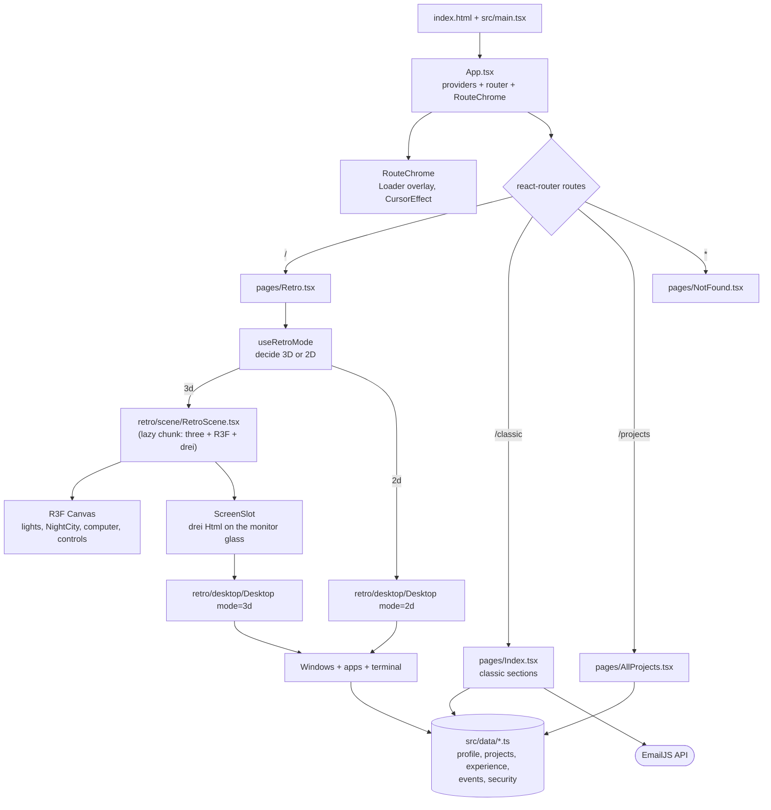

# Architecture

## In one paragraph

The site is a **static, frontend-only single-page app** (Vite + React 18 + TypeScript). It has two
"faces" that share the same content files. At `/`, a **3D scene** (three.js through React Three
Fiber) shows a beige 90s computer on a desk in front of a night-time Boston window. Clicking the
monitor flies the camera in, and the monitor shows a **real, interactive React desktop ("LINH-OS")**
with draggable windows and a terminal. On small screens, without WebGL, or with reduced motion,
the same desktop renders flat (2D) instead. At `/classic` is the original scrolling editorial
portfolio (Tailwind + Framer Motion), and `/projects` lists every project. Nothing on `/` links
to them; they're reachable by URL (and `/classic` links to `/projects`). There is no backend: content
lives in TypeScript files under `src/data/`, and the classic contact form sends email through
EmailJS directly from the browser.

## System map



## Entry points

| Step | File | What happens |
|---|---|---|
| 1 | [index.html](../index.html) | One `<div id="root">` and a module script pointing at `src/main.tsx`. |
| 2 | [src/main.tsx](../src/main.tsx) | `createRoot(...).render(<App />)` and imports global CSS (`index.css`). |
| 3 | [src/App.tsx](../src/App.tsx) | Wraps everything in `QueryClientProvider`, `TooltipProvider`, two toast hosts, `BrowserRouter`. Declares the routes. Renders `RouteChrome` (loader + custom cursor). |
| 4 | [src/pages/Retro.tsx](../src/pages/Retro.tsx) | Route `/`. Picks 3D vs 2D, lazy-loads the 3D scene, catches its failures. |

## Major systems

Each system below answers: what, where, depends on, depended on by, why, data movement, and what breaks.

### 1. Routing and page chrome
- **What:** URL → page, plus things that sit above every page (boot loader, custom cursor).
- **Where:** [src/App.tsx](../src/App.tsx), [src/components/Loader.tsx](../src/components/Loader.tsx), [src/components/cursorEffect.tsx](../src/components/cursorEffect.tsx).
- **Depends on:** `react-router-dom` v6.
- **Depended on by:** all pages.
- **Why:** the 3D desktop took over `/`, so the classic site moved to `/classic` (CONFIRMED in [hiw.md §18](../hiw.md)). `RouteChrome` shows a BIOS-style boot loader on `/` (4.6 s) and a sketch-frame loader elsewhere (2.1 s), and only enables the custom cursor off `/` because `/` uses the pixel cursors instead (`RouteChrome` toggles `html.retro-cursor`; CONFIRMED by comments in `App.tsx`).
- **Data:** `useLocation().pathname` → loader variant and cursor on/off. The loader variant is captured **once** at first render (`useState` initializer), so navigating later doesn't re-show it.
- **If removed/changed:** removing `RouteChrome` drops the loader and cursor only. Changing route paths breaks hard-coded `<Link to>`s on the classic pages (e.g. `/projects`'s "Back to home" → `/`).

### 2. Retro mode selection (3D vs 2D)
- **What:** decides whether `/` shows the 3D desk or the flat desktop.
- **Where:** [src/retro/useRetroMode.ts](../src/retro/useRetroMode.ts), [src/pages/Retro.tsx](../src/pages/Retro.tsx).
- **Depends on:** `matchMedia`, a WebGL probe, `?mode=` URL param, `localStorage["retro-mode"]`.
- **Depended on by:** `Retro.tsx` only.
- **Why:** the 3D view is unreadable on small screens, costly without a GPU, and motion-heavy (CONFIRMED by comments). `decideRetroMode` is a pure function so it is unit-tested ([retroMode.test.ts](../src/test/retro/retroMode.test.ts)).
- **Rules (in priority order):** no WebGL → 2D · explicit choice (`?mode=2d|3d` or saved button choice) → that · viewport < 900×600 → 2D · `prefers-reduced-motion` → 2D · otherwise 3D.
- **Failure path:** `RetroScene` is loaded with `React.lazy`. If the chunk fails to load or rendering throws, `SceneErrorBoundary` calls `reportWebglFailure` → `webgl=false` → 2D. A runtime `webglcontextlost` event does the same, but only while the scene is mounted: R3F calls `gl.forceContextLoss()` when the Canvas unmounts (switching to 2D), and that self-inflicted loss used to mark WebGL as broken, hiding every way back to 3D for the rest of the visit.
- **If removed/changed:** without it, phones and non-WebGL browsers get a broken or blank `/`.

### 3. The 3D scene ("the desk")
- **What:** everything drawn by WebGL: lights, room, window, skyline, computer, keyboard, mouse, potted plant, sticky notes, plus camera behaviour.
- **Where:** [src/retro/scene/](../src/retro/scene/): `RetroScene.tsx` (composition + state), `CameraRig.tsx` (zoom animation), `ProceduralComputer.tsx` (the computer, built in code), `NightCity.tsx` (wall, window, skyline), `ScreenSlot.tsx` (puts the desktop on the glass), `model.config.ts` (which model, where the screen is), `GlbComputer.tsx` (optional downloaded model).
- **Depends on:** `three`, `@react-three/fiber`, `@react-three/drei`, and the desktop system (rendered on the screen).
- **Depended on by:** `Retro.tsx` (lazy import).
- **Why:** it's the portfolio's centrepiece. Details: [3D_ARCHITECTURE.md](3D_ARCHITECTURE.md).
- **Data:** two React booleans drive the whole scene: `zoomed` (visitor asked to zoom) and `active` (camera has arrived, screen is interactive). See [DATA_FLOW.md](DATA_FLOW.md).
- **If removed/changed:** `/` always uses the 2D desktop (that path already works on its own).

### 4. The desktop OS ("LINH-OS")
- **What:** a window manager: icons, windows (open/close/focus/drag), taskbar with clock, six apps (About, Experience, Community, Projects, Contact, Terminal).
- **Where:** [src/retro/desktop/](../src/retro/desktop/). State in `useDesktop.ts` (a pure reducer), UI in `Desktop.tsx`, `Window.tsx`, `Taskbar.tsx`, app registry in `apps.tsx`, terminal logic in `terminal/commands.ts`.
- **Depends on:** `src/data/*`, `DesktopContext` (for navigation and power-off, because it can't reach the router, see below).
- **Depended on by:** `ScreenSlot` (3D) and `Retro.tsx` (2D).
- **Why it's DOM, not 3D:** text stays crisp, accessible and fully interactive (CONFIRMED, [hiw.md §18](../hiw.md) and the `ScreenSlot` comment).
- **Boundary to know about:** in 3D, drei's `<Html>` mounts the desktop in a **separate React root**, so React context from outside (router, providers) does **not** reach it. Everything it needs (`navigate`, `onPowerOff`) is passed as props and re-exposed through `DesktopContext` (CONFIRMED, comment in [DesktopContext.ts](../src/retro/desktop/DesktopContext.ts)).
- **If removed/changed:** the 3D monitor shows a dark glass plane only (the `glass` mesh in `ProceduralComputer`).

### 5. Shared content layer
- **What:** plain TypeScript modules exporting arrays/objects: bio, stats, socials, projects (+ images), experience, events, security highlights.
- **Where:** [src/data/](../src/data/).
- **Depends on:** images in `src/assets/` (imported, so Vite fingerprints and bundles them).
- **Depended on by:** classic sections, retro apps, terminal commands, security badges.
- **Why:** "Edit here and both update" (CONFIRMED, comment in `profile.ts`).
- **If changed:** renaming an experience/project title silently drops it from `securityHighlights` (it matches by exact string). A test guards the current list ([retroMode.test.ts](../src/test/retro/retroMode.test.ts)).

### 6. Classic site
- **What:** the scrolling editorial portfolio: Navbar, Hero, About, Experience, Community, Projects carousel, Contact (postcard form), Footer.
- **Where:** [src/pages/Index.tsx](../src/pages/Index.tsx), [src/components/](../src/components/), `index.css`, `tailwind.config.ts`.
- **Depends on:** Tailwind, shadcn/ui `Dialog`, Framer Motion, EmailJS, `src/data`.
- **Why / how:** documented in depth in [hiw.md](../hiw.md) (partly outdated, see [DEVELOPMENT_NOTES.md](DEVELOPMENT_NOTES.md)).
- **Note on "3D" here:** the project cards and event postcards use **CSS 3D transforms** (`perspective`, `rotateX/Y`, `backface-visibility`) animated by Framer Motion. That's not WebGL. It's the browser's compositor transforming flat DOM boxes.

## Rendering lifecycle at `/` (3D path)

```mermaid
sequenceDiagram
    participant B as Browser
    participant R as Retro.tsx
    participant M as useRetroMode
    participant S as RetroScene (lazy)
    participant F as R3F Canvas
    participant H as drei Html (separate React root)
    B->>R: route "/" renders
    R->>M: smallViewport? reducedMotion? webgl? forced?
    M-->>R: mode = "3d"
    R->>S: lazy import (Suspense shows "loading desk...")
    S->>F: create WebGL renderer, camera, scene
    F->>F: Environment + ContactShadows render once (frames=1)
    F->>H: Html creates DOM root, renders <Desktop mode="3d" active=false>
    F->>F: draw frame (frameloop="demand": only when invalidated)
    Note over F: Idle: orbit drags invalidate frames; nothing renders when still
```

Meanwhile the BIOS loader overlay from `RouteChrome` covers the screen for 4.6 s regardless of
whether loading has finished (CONFIRMED: time-based `setTimeout` in `App.tsx`).

## Boundaries between systems

| Boundary | What crosses it | Mechanism |
|---|---|---|
| Page ↔ 3D scene | `navigate`, `onSwitchTo2d`, `onFailure` | props on `RetroScene` |
| 3D scene ↔ desktop | `active`, `navigate`, `onPowerOff`, `focusOnActivate` | props through `ScreenSlot` → `Desktop` |
| Desktop ↔ apps | `openApp`, `closeApp`, `navigate`, `powerOff`, `mode`, `compact` | `DesktopContext` |
| React ↔ three.js objects | props → object properties | R3F reconciler (declarative) |
| Animation ↔ camera | per-frame position/target | `useFrame` + refs (imperative, no React state) |
| UI ↔ content | arrays/objects | ES imports from `src/data` |
| Browser ↔ outside world | email | EmailJS SDK (classic Postcard only) |

## Important abstractions

- **`ScreenRect`** ([model.config.ts](../src/retro/scene/model.config.ts)): the position, rotation and size of the monitor glass in world units. Camera zoom, the CRT glow light and the HTML desktop all derive from it, so it's the single source of truth that ties 3D and DOM together.
- **`COMPUTER_MODEL`**: a discriminated union (`procedural` | `glb`). Swapping models is a config change.
- **`desktopReducer`**: all window-manager state transitions as a pure function.
- **`runCommand`**: the terminal as a pure function `input → { lines, action }`; the React component executes the `action`.
- **`AppDefinition` / `APPS`**: the registry that turns an id into icon + window + component.

## What is *not* here

- No backend, database, authentication or API routes (CONFIRMED: no server code; only EmailJS).
- No global state library (no Redux/Zustand). State is local React state, one reducer, and one context.
- No physics, no GLSL authored in this repo, no post-processing, no loaded 3D models by default.
- TanStack Query is installed and its provider is mounted, but nothing calls `useQuery` (CONFIRMED by search). It's almost certainly scaffold leftover (INFERRED).
