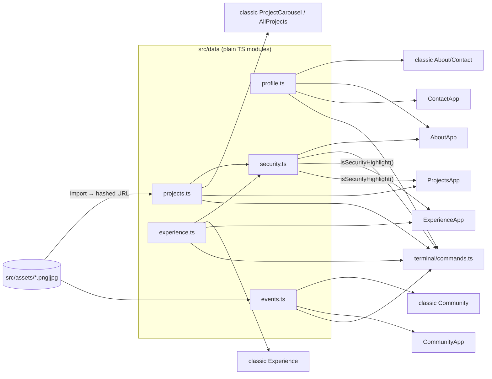
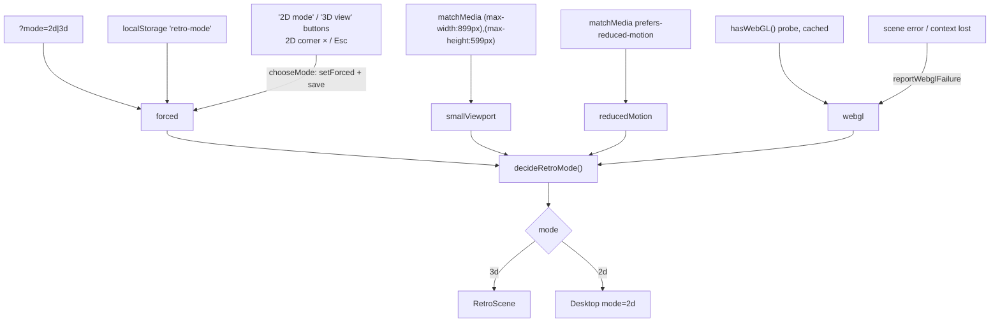
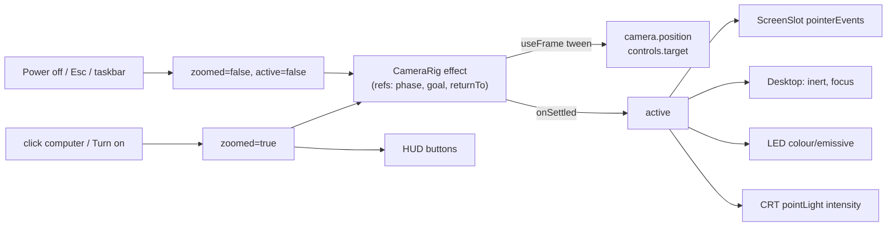
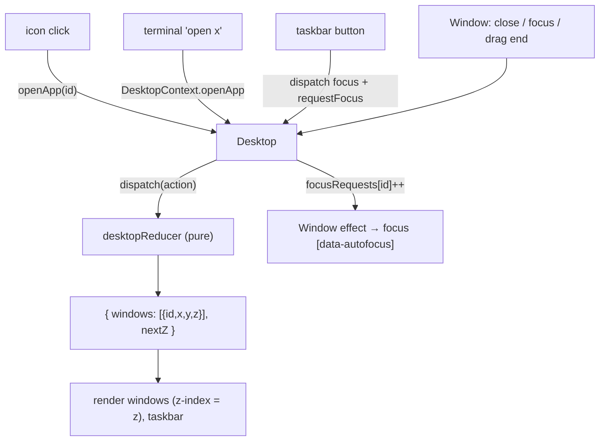
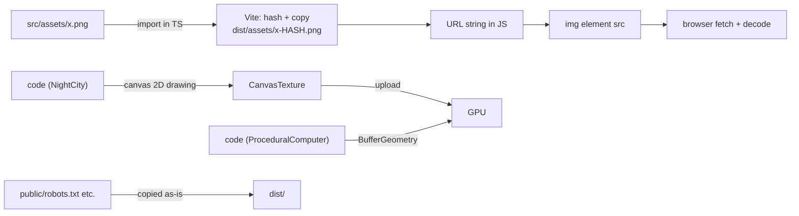

# Data flow

How content, state and assets move through the app. There is no server and no global store, so
everything below is either a module import, React state, or a browser API.

## 1. Content: `src/data` → both sites



- Content is **static at build time**. Changing it means editing a `.ts` file and rebuilding.
- Images are **imported** (`import sprout from "@/assets/projects/sprout.jpg"`), so Vite copies them to
  `dist/assets/` with a content hash and the import evaluates to that URL string.
- `security.ts` doesn't hold its own copy of anything: it **looks up** entries in `experience.ts` and
  `projects.ts` by exact `role`+`company` or `title`. Rename a source entry and its highlight silently
  disappears. `retroMode.test.ts` asserts the current list to catch that.
- `projects[].featured` decides the classic homepage carousel; `category` groups `/projects`.

## 2. Retro mode decision



The URL parameter wins over the saved choice. Media queries are live: rotating a tablet or resizing
below 900×600 switches to 2D immediately (unless a mode is forced).

## 3. 3D scene state



Data only flows **down** as props and **up** through callbacks (`onSettled`, `onPowerOff`,
`navigate`, `onSwitchTo2d`, `onFailure`). There is no shared store.

## 4. Desktop state



- **Open** an already-open window = **focus** it (no duplicates).
- New windows **cascade** (6 slots, 26 px apart) from (132, 20).
- **Z-order** is a monotonically increasing counter: focusing gives a window `nextZ`.
- The reducer is pure and has unit tests (`desktopState.test.ts`).

## 5. Terminal command flow

```text
input string ──► runCommand(input, history)            (pure, terminal/commands.ts)
                   │  split → alias → handler
                   ▼
                { lines: TerminalLine[], action?: open | clear | exit }
                   │
TerminalApp ◄──────┘
   ├─ append prompt line + output lines (capped at 400)
   └─ execute action via DesktopContext: openApp / closeApp("terminal")
```

Keeping the interpreter pure means it's tested without rendering anything (`commands.test.ts`).

## 6. Navigation across the React-root boundary

```text
Retro.tsx  (inside <BrowserRouter>) ── useNavigate() ──► navigate
   └─ RetroScene (prop) ── ScreenSlot (prop) ── drei Html: NEW React root (no router context!)
         └─ Desktop (prop) ── DesktopContext.navigate   (currently no caller)
```

If an app inside the desktop called `useNavigate()` directly, it would throw in 3D mode. Use `useDesktopContext().navigate`.
Nothing on the desktop or HUD links away from `/` any more (the "Classic site" icon, HUD button,
terminal command and Projects-app link were removed); the plumbing stays for future links.

## 7. Classic-site flows (summary)

| Flow | Path |
|---|---|
| Dark mode | `Navbar` `isDark` state → toggles `.dark` on `<html>` → CSS variables + Tailwind `dark:` variants; `CursorEffect` watches the class with a `MutationObserver`. Not persisted. |
| Section navigation | navbar buttons → `document.getElementById(id).scrollIntoView({behavior:"smooth"})` |
| Project carousel | wheel/touch deltas accumulate in refs → `goTo(i)` (700 ms lock) → `current` state → Framer Motion animates CSS 3D card transforms; click front card → `ProjectDetailDialog` |
| Contact postcard | form state → `emailjs.send(serviceId, templateId, {name,email,message}, publicKey)` → EmailJS servers send the mail |

## 8. Browser storage and URL

| Key | Where | Written by | Read by |
|---|---|---|---|
| `localStorage["retro-mode"]` = `"2d"`/`"3d"` | browser | `chooseMode` (HUD/taskbar buttons) | `useRetroMode` on load |
| `?mode=2d` / `?mode=3d` | URL | you (for testing/sharing) | `useRetroMode` on load |

Nothing else is persisted: dark mode, open windows and terminal history reset on reload.

## 9. Assets: file → screen



No 3D asset files are fetched today; all 3D content is generated from code at runtime. Image
assets are used only by the DOM (classic site and desktop apps).
