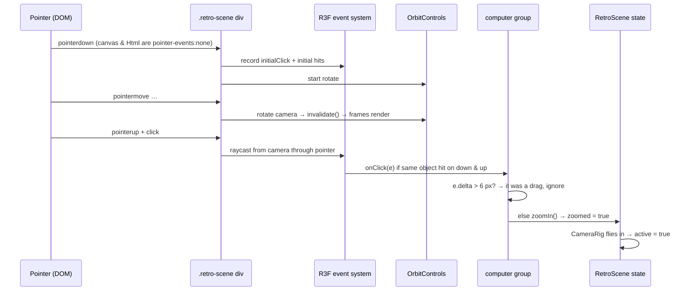

# Interaction guide

How a visitor's mouse, finger and keyboard become 3D interactions and app state. Concepts first,
then exactly how this project does it.

Contents:
1. [Every input channel at `/`](#1-every-input-channel-at-)
2. [Raycasting from first principles](#2-raycasting-from-first-principles)
3. [How React Three Fiber does it](#3-how-react-three-fiber-does-it)
4. [This project's pointer pipeline](#4-this-projects-pointer-pipeline)
5. [Who receives the pointer? (layers)](#5-who-receives-the-pointer-layers)
6. [Interacting with the desktop on the screen](#6-interacting-with-the-desktop-on-the-screen)
7. [Keyboard and focus](#7-keyboard-and-focus)
8. [Where interaction state lives](#8-where-interaction-state-lives)
9. [Visual feedback](#9-visual-feedback)
10. [How to think about 3D interaction](#10-how-to-think-about-3d-interaction)

---

## 1. Every input channel at `/`

| Input | Where it enters | What it does |
|---|---|---|
| Drag on the scene (mouse or touch) | `OrbitControls`, listening on the `.retro-scene` div | orbits the camera around the desk (idle only) |
| Hover over the computer | R3F `onPointerOver`/`onPointerOut` on the computer `<group>` | pointer cursor (`.is-hovering` class) |
| Click the computer or its screen | R3F `onClick` on the same group | zoom in (`zoomed = true`) |
| "Turn on the computer" button | HUD `<button>` | zoom in (keyboard-accessible alternative) |
| "Power off" button / taskbar Power off / `Esc` | HUD, taskbar, `window` keydown, desktop keydown | zoom out |
| "2D mode" | HUD button | switch to the flat desktop |
| Clicks, typing, drags *on the screen* | the DOM desktop (normal React events) | windows, apps, terminal (only once `active`) |

There is no hit-testing for anything else in the scene: the city, the wall, the desk and the vase
are part of the computer group (desk, vase) or not interactive at all (city, wall).

---

## 2. Raycasting from first principles

### What it means
**Raycasting** answers "what 3D thing is under this 2D pixel?". You shoot an invisible straight
line (a **ray**) from the camera through the pixel into the scene and see what it hits first.

### Why it's needed
The screen is flat; the scene isn't. A pixel doesn't correspond to a single 3D point. It
corresponds to every point along a line going away from the eye. The ray *is* that line.

### How it works

```text
2D pointer (clientX, clientY) in CSS pixels
        │  normalise to −1…+1, flip Y
        ▼
NDC (x, y)                      e.g. centre of the window = (0, 0)
        │  "unproject" with the camera (inverse projection + camera transform)
        ▼
Ray = origin (camera position) + direction (unit vector through that pixel)
        │  test against each object's triangles (bounding sphere/box check first)
        ▼
Intersections, sorted nearest first:
  { object, point (world xyz), distance, face (normal), uv, … }
        │  pick the first, or let handlers decide
        ▼
Application logic (hover, select, zoom, drag…)
        │
        ▼
Application state → new render
```

- **Ray origin**: for a perspective camera, the camera's position.
- **Ray direction**: a normalized vector from the camera through the pixel's spot on the near plane.
- **Intersection point**: where the ray meets a triangle, in world space.
- **Hit testing** cost grows with the number of triangles tested. Libraries first check cheap bounding spheres to skip objects the ray clearly misses.

In plain three.js you'd write:
```ts
raycaster.setFromCamera(ndc, camera);
const hits = raycaster.intersectObjects(scene.children, true);
```
In R3F you almost never write that yourself; the event system does it for you.

### Concrete example in this scene
When idle on a wide window, the camera sits at about `(1.65, 2.78, 4.70)` looking at `(0, 0.95, 0.35)`.
A click in the exact centre of the window produces a ray along that look direction. It passes
through the bezel opening and hits the screen plane near its lower edge, around `(0, 0.96, 0.36)`
(INFERRED by hand calculation from the constants; useful as a sanity check, not a spec).

---

## 3. How React Three Fiber does it

R3F turns DOM pointer events into 3D events that look like React events:

1. R3F attaches DOM listeners (`pointerdown`, `pointermove`, `pointerup`, `click`, `wheel`…) to an
   element: by default the canvas, here the `eventSource` div.
2. On each event it computes NDC from the pointer position and calls `raycaster.setFromCamera`.
3. It raycasts **only objects that have R3F handlers** (and their descendants, recursively). It keeps
   a list of them internally (`internal.interaction`). Objects without handlers in their ancestry are never tested.
4. For each hit it calls the handler on the hit object **and bubbles up to its ancestors**, like DOM
   events. `e.stopPropagation()` stops the bubbling and also stops objects *behind* from receiving it.
5. `onClick` only fires if `pointerdown` and `pointerup` hit the same object.

The event object you receive (`ThreeEvent`) includes:

| Field | Meaning |
|---|---|
| `e.object` | the actual mesh that was hit (could be the bezel, a key, the invisible screen plane…) |
| `e.eventObject` | the object whose handler is running (here, the computer `<group>`) |
| `e.point` | world-space hit point (`Vector3`) |
| `e.distance` | distance from the camera to the hit |
| `e.face?.normal`, `e.uv` | surface normal and texture coordinate at the hit |
| `e.ray`, `e.camera` | the ray and camera used |
| `e.delta` | pixels the pointer moved between down and up (used to tell clicks from drags) |
| `e.nativeEvent` | the original DOM event |

Further reading: [R3F events docs](https://docs.pmnd.rs/react-three-fiber/api/events).

---

## 4. This project's pointer pipeline

### Setup ([RetroScene.tsx](../src/retro/scene/RetroScene.tsx))
```tsx
<div ref={containerRef} className="retro-scene">
  <Canvas eventSource={containerRef} eventPrefix="client" …>
    …
    <group onClick={onComputerClick}
           onPointerOver={() => setHovering(true)}
           onPointerOut={() => setHovering(false)}>
      <ProceduralComputer … />
      <ScreenSlot … />          {/* contains drei's invisible occlusion plane */}
    </group>
    <OrbitControls makeDefault … />
```

**Why `eventSource`?** With `occlude="blending"`, drei sets the canvas to `pointer-events: none`
(so the DOM behind it could be clickable). A canvas that ignores the pointer can't receive events,
so R3F listens on the wrapper div instead. drei's `OrbitControls` also attaches to that element
(it uses R3F's `events.connected`). CONFIRMED in drei/R3F source and [hiw.md §18](../hiw.md).

**Why `eventPrefix="client"`?** It makes R3F compute the pointer from `clientX/clientY` instead of
`offsetX/offsetY`. `offset*` is relative to the event's *target* element, which can be any child
of the wrapper; `client*` is relative to the viewport. The scene fills the viewport (`.retro-page` is
`position: fixed; inset: 0`, `.retro-scene` is `inset: 0`), so client coordinates equal canvas coordinates
(CONFIRMED in R3F's `Canvas` source; the full-viewport precondition is INFERRED from the CSS). If you
ever put the scene in a box that isn't at the viewport's top-left, picking will be offset.

### Hover
```ts
const setHovering = (hovering: boolean) =>
  containerRef.current?.classList.toggle("is-hovering", hovering && !zoomed);
```
Direct DOM class toggle, no React state, so hover doesn't re-render the scene. `html.retro-cursor .retro-scene.is-hovering` swaps in the pixel hand cursor (see [3D_ARCHITECTURE → Cursors](3D_ARCHITECTURE.md#cursors)).

### Click → zoom
```ts
const onComputerClick = (e: ThreeEvent<MouseEvent>) => {
  e.stopPropagation();
  if (e.delta > 6 || zoomed) return;   // ignore the click that ends an orbit drag; ignore when already zoomed
  setHovering(false);
  zoomIn();                            // setZoomed(true)
};
```



**What can be clicked:** every mesh in `ProceduralComputer` (desk, vase and keyboard included,
since they're all inside the group) plus the invisible screen plane. Clicking the window or the
city does nothing (they have no handlers).

**Why clicking the screen works even though the screen is HTML:** drei's occlusion plane is a real
mesh inside the `Html` group, which is inside the computer group. The ray hits that plane, and the
event bubbles to the group's `onClick` (CONFIRMED in drei's `Html.js`: the plane is created when
`occlude` is set and not ray-cast mode).

### Drag → orbit
`OrbitControls` handles drags entirely by itself. It converts pointer movement into changes of
azimuth/polar angle around `target`, clamps them to the limits, and applies damping. Pan and zoom
(wheel/pinch) are disabled. `.retro-scene { touch-action: none }` stops touch drags from scrolling the page.

### Click vs drag
Both start with `pointerdown`. The rule here: if the pointer moved more than **6 px** between down
and up (`e.delta`), it was an orbit drag, not a click. Without this, every orbit that ends over the
monitor would zoom you in.

---

## 5. Who receives the pointer? (layers)

```text
 z-order (top → bottom)              pointer-events     idle (zoomed out)          active (zoomed in)
 ─────────────────────────────────────────────────────────────────────────────────────────────────
 HUD buttons (.retro-hud, z 10)      auto on buttons    clicks buttons             clicks buttons
 WebGL <canvas> (z 50 in its ctx)    none (drei)        transparent to pointer     transparent to pointer
 drei Html wrapper                   none               —                          —
   └ inner div with <Desktop>        none → auto        transparent                RECEIVES clicks/typing
 .retro-scene div (eventSource)      auto               receives → R3F + Orbit     receives bubbled events
```

While **active**, desktop events bubble up to `.retro-scene`, so R3F still raycasts them and may
call `onComputerClick` (the ray hits the screen plane). The `|| zoomed` guard turns that into a
no-op, and OrbitControls are disabled by CameraRig, so dragging a window doesn't orbit the camera.

The desktop root also gets the HTML `inert` attribute while inactive, so even keyboard Tab can't
reach it during idle (CONFIRMED: `Desktop.tsx` toggles `inert` from `active`).

---

## 6. Interacting with the desktop on the screen

Once `active`, the screen is a normal web page. All the desktop's interactions are ordinary React
DOM events. Only one of them needs 3D awareness: **dragging windows**.

### Dragging in a CSS-transformed space ([Window.tsx](../src/retro/desktop/Window.tsx))
The desktop is laid out at 800×600 CSS px but displayed scaled by drei's `matrix3d`. A mouse that
moves 100 screen pixels might move only ~70 desktop pixels. So on drag start:

```ts
// In 3D the desktop is scaled by a CSS matrix; convert screen px back to desktop px.
const scale = parent.getBoundingClientRect().width / parent.offsetWidth || 1;
…
const nx = d.x + (e.clientX - d.startX) / d.scale;
```

- `getBoundingClientRect().width` is the **on-screen** (transformed) width; `offsetWidth` is the **layout** width.
  Their ratio is the current visual scale. In 2D it's 1.
- A single ratio is only exact when the desktop is seen head-on (no perspective skew). Windows can only be
  dragged while `active`, which is always the head-on close-up, so this holds (INFERRED reasoning).
- During the drag, `style.left/top` are mutated directly; React state (`move` action) is updated once on release.
  That avoids re-rendering the whole desktop on every `pointermove` (CONFIRMED by the comment).
- `setPointerCapture` keeps the drag going if the pointer leaves the title bar.
- Positions are clamped so at least 72 px of the title bar stays reachable.

### Other 3D-aware details in the desktop
- `focus({ preventScroll: true })` everywhere, and the terminal scrolls with `scrollTop`, not
  `scrollIntoView`. A scroll-into-view inside the transformed, overflow-hidden layer "would shift the
  whole screen" (CONFIRMED, comments in `Window.tsx` and `TerminalApp.tsx`).
- The desktop measures its area with `offsetWidth/offsetHeight` and `ResizeObserver.contentRect`
  (layout sizes), not bounding rects, which would be the *transformed* size in 3D.

---

## 7. Keyboard and focus

| Key / action | Handled by | Result |
|---|---|---|
| `Esc` inside a window | `Window` `onKeyDown` (stops propagation) | closes that window |
| `Esc` elsewhere on the desktop | `Desktop` `onKeyDown` | closes the top window, or if none: powers off (3D) / exits 2D mode to the 3D desk |
| `Esc` outside the desktop while zoomed | `window` keydown listener in `RetroScene` (skips events from inside `.retro-desktop`) | powers off |
| `Esc` outside the desktop in 2D (e.g. focus on `<body>` after load) | `window` keydown listener in `pages/Retro.tsx` (same `.retro-desktop` skip) | exits 2D mode |
| Corner × (`.retro-desktop__exit`, 2D only) | `Desktop` | exits 2D mode (same as taskbar "3D view") |
| Mouse wheel over a window (3D) | non-passive `wheel` listener on the `Desktop` root | scrolls the nearest scrollable ancestor manually ([3D_GUIDE §17](3D_GUIDE.md#17-scrolling-inside-css-3d-transforms)) |

2D mode can only be exited when 3D is available: WebGL works and the viewport isn't small (≥ 900×600).
Otherwise there's no × and Esc with no windows open does nothing.
| Zoom in completes | `Desktop` effect (`focusOnActivate`) | focuses the first desktop icon |
| Power off completes | `RetroScene` effect | focuses "Turn on the computer" |
| Open a window | `Desktop.openApp` | remembers the opener, focuses `[data-autofocus]` or the window |
| Close a window | `Desktop.closeApp` | returns focus to the opener (or the icon) *before* unmounting |
| `↑`/`↓` in terminal | `TerminalApp` | command history |

The HUD's "Turn on the computer" button means the 3D click is never the *only* way in, which keeps
the page keyboard- and screen-reader-accessible.

---

## 8. Where interaction state lives

| State | Kind | Owner | Read by |
|---|---|---|---|
| `zoomed` (intent) | React `useState` | `RetroScene` | HUD, CameraRig, Esc listener, hover guard |
| `active` (arrived) | React `useState` | `RetroScene` | ScreenSlot/Desktop, ProceduralComputer LEDs, CRT glow |
| camera phase, goal, returnTo | refs | `CameraRig` | CameraRig's `useFrame` |
| orbit angles, damping, target | inside the OrbitControls instance | drei / three-stdlib | camera, CameraRig (`controls.target`) |
| hover | CSS class on the container | `RetroScene` (`setHovering`) | CSS |
| windows (open, position, z) | `useReducer` | `Desktop` (`desktopReducer`) | Desktop, Taskbar |
| drag in progress | ref + inline style | `Window` | Window |
| focus requests | `useState` counters | `Desktop` | Window effect |
| terminal lines/history | `useState` | `TerminalApp` | TerminalApp |
| 3D vs 2D choice | `useState` + `localStorage["retro-mode"]` + `?mode=` | `useRetroMode` | `Retro.tsx` |

---

## 9. Visual feedback

| Interaction | Feedback | Where |
|---|---|---|
| hover computer | pointer cursor | `.retro-scene.is-hovering` in `retro.css` |
| idle screen | blinking "click the screen to start" | `Desktop` (`!active`), `retro-blink` animation |
| zoom in | camera glides ~1.5 s; HUD swaps to "Power off" | CameraRig, RetroScene |
| arrived | power LEDs turn green and brighter; CRT glow light 1.1 → 1.8 | ProceduralComputer (`poweredOn`), RetroScene `pointLight` |
| always on screen | scanlines + vignette + flicker; glass sheen | `.retro-crt`, `.retro-desktop--3d::after` |
| focused window | coloured title bar | `.retro-window.is-focused` |

---

## 10. How to think about 3D interaction

Practical mental models, each tied to this project.

### Model 1: Everything lives somewhere
Every position is relative to a parent. The chin LED's `[0.5, 0, 0.004]` is relative to the chin
group, which is relative to the monitor group. When a ray reports `e.point`, that's **world** space;
to compare it with a child's `position` you'd convert it with `object.worldToLocal(point.clone())`.
*In this project:* `ScreenRect` values are world coordinates; everything inside `ProceduralComputer` is local.

### Model 2: The camera is the viewer
Nothing on screen moves when you orbit. The *camera* moves. "Zoom in" here doesn't scale the
computer; it flies the camera to a spot 1.77 units in front of the glass. If something looks wrong,
ask whether the object or the camera is where you think.

### Model 3: The screen is 2D, the world is 3D
A pixel is a **ray**, not a point. You can't turn a click into a 3D position without picking *what*
along that ray you mean: the first mesh hit, or a mathematical plane (e.g. "the desk at y=0" with
`ray.intersectPlane`). R3F picks the first hit among objects with handlers.

### Model 4: Interaction usually becomes geometry
A click becomes a ray → an intersection → `{ point, normal, distance, object }`. Useful
interactions are built on those: place something at `e.point`, orient it to `e.face.normal`, select
`e.object`. *In this project* only the fact that *something in the group* was hit matters; the
zoom target comes from config (`ACTIVE_SCREEN`), not from the hit point.

### Model 5: The scene is a hierarchy
Events bubble up the scene graph like DOM events up the DOM tree. That's why one `onClick` on the
outer group covers every mesh of the computer, desk and props, plus the screen plane. Put handlers on the **smallest group that
means one thing to the user**, and `stopPropagation()` when an inner object should win.

### Model 6: Two worlds, one screen (project-specific)
There are two rendering systems stacked in the same rectangle: WebGL (the desk) and the DOM (the
desktop), aligned by a `matrix3d` every frame. Input goes to whichever layer accepts pointer events
(§5). When debugging a "click didn't work", first ask: *which world was supposed to receive it?*

### Model 7: Intent vs arrival (project-specific)
`zoomed` is what the visitor asked for; `active` is when the world is ready. Any interaction that
depends on an animation finishing should wait for the "arrived" signal, not the request.

### Model 8: One driver per camera (project-specific)
At any moment exactly one thing drives the camera: OrbitControls (idle) or CameraRig (transitions
and close-up). Two drivers fight, and the symptom is jitter or the camera snapping back. Hand over
explicitly (`controls.enabled = false/true`).

### Model 9: Click vs drag is a threshold
The same physical gesture starts both. Decide by distance moved (`e.delta > 6`), time, or both.

### Model 10: Pixels under a transform aren't pixels
Inside the 3D screen, a CSS pixel and a screen pixel differ by the current scale. Any pointer maths
inside the desktop must divide by that scale (see the window drag), and any scrolling must stay
local (`preventScroll`).

---

Adding your own interaction: [CHANGE_GUIDE.md → Add a new interaction](CHANGE_GUIDE.md#add-a-new-interaction).
